# AAROGYA SATHI — Advanced DBMS Document
## ER, EER, Relational Schema, PL/SQL, Triggers & Advanced Features

**Version:** 3.1 (B2C Only) | **Date:** March 10, 2026 | **Database:** PostgreSQL 15+ | **Tables:** 13

> 📌 **Visual ER Diagram:** Open [ER_DIAGRAM.html](ER_DIAGRAM.html) in a browser for the interactive version with all 13 entities, relationships, and EER specialization diagrams.

---

## Table of Contents

1. [ER Diagram (13 Entities)](#1-er-diagram)
2. [Enhanced ER (EER) Diagram](#2-enhanced-er-eer-diagram)
3. [Relational Schema & Normalization](#3-relational-schema--normalization)
4. [Custom Types & Domains](#4-custom-types--domains)
5. [Stored Procedures](#5-stored-procedures)
6. [Functions](#6-functions)
7. [PL/SQL Packages](#7-plsql-packages)
8. [Triggers](#8-triggers)
9. [Cursors](#9-cursors)
10. [Views & Materialized Views](#10-views--materialized-views)
11. [Advanced Indexing](#11-advanced-indexing)
12. [Partitioning Strategy](#12-partitioning-strategy)
13. [CTEs & Window Functions](#13-ctes--window-functions)
14. [Transaction Management](#14-transaction-management)
15. [Row-Level Security](#15-row-level-security)

---

## 1. ER Diagram

### 1.1 Entities (13 Tables)

| # | Entity | Primary Key | Description |
|---|--------|-------------|-------------|
| 1 | **USERS** | `id` (UUID) | Core user profile, auth, preferences |
| 2 | **HEALTH_RECORDS** | `id` (UUID) | BP, sugar, symptoms, lifestyle, medication logs |
| 3 | **CHAT_HISTORY** | `id` (UUID) | AI chat messages + responses |
| 4 | **MEDICAL_REPORTS** | `id` (UUID) | Uploaded reports with OCR biomarkers |
| 5 | **ENVIRONMENTAL_ALERTS** | `id` (UUID) | AQI, heatwave, cold wave alerts |
| 6 | **HEALTH_CONDITIONS** | `id` (UUID) | Chronic conditions (diabetes, hypertension) |
| 7 | **USER_PREFERENCES** | `id` (UUID) | Notification, voice, dark mode settings |
| 8 | **AUTH_SESSIONS** | `id` (UUID) | JWT sessions, device tracking |
| 9 | **ABDM_INTEGRATIONS** | `id` (UUID) | ABHA health ID linkage |
| 10 | **SUBSCRIPTIONS** | `id` (UUID) | Free/Premium plan management |
| 11 | **USER_ANALYTICS** | `id` (UUID) | Daily usage metrics |
| 12 | **API_USAGE** | `id` (UUID) | Per-request token/cost tracking |
| 13 | **USER_FEEDBACK** | `id` (UUID) | App ratings and feedback |

### 1.2 ER Diagram (Mermaid)

```mermaid
erDiagram
    USERS ||--o{ HEALTH_RECORDS : "logs"
    USERS ||--o{ CHAT_HISTORY : "sends"
    USERS ||--o{ MEDICAL_REPORTS : "uploads"
    USERS ||--o{ ENVIRONMENTAL_ALERTS : "receives"
    USERS ||--o{ HEALTH_CONDITIONS : "has"
    USERS ||--|| USER_PREFERENCES : "configures"
    USERS ||--o{ AUTH_SESSIONS : "authenticates"
    USERS ||--o| ABDM_INTEGRATIONS : "links"
    USERS ||--o{ SUBSCRIPTIONS : "subscribes"
    USERS ||--o{ USER_ANALYTICS : "generates"
    USERS ||--o{ API_USAGE : "consumes"
    USERS ||--o{ USER_FEEDBACK : "submits"

    USERS {
        UUID id PK
        VARCHAR email UK
        VARCHAR phone UK
        VARCHAR password_hash
        VARCHAR first_name
        VARCHAR last_name
        DATE date_of_birth
        ENUM gender
        VARCHAR preferred_language
        VARCHAR preferred_city
        ENUM subscription_plan
        BOOLEAN is_active
        TIMESTAMP created_at
        TIMESTAMP updated_at
        TIMESTAMP deleted_at
    }

    HEALTH_RECORDS {
        UUID id PK
        UUID user_id FK
        ENUM record_type
        INT bp_systolic
        INT bp_diastolic
        INT heart_rate
        INT blood_sugar_fasting
        INT blood_sugar_random
        DECIMAL weight_kg
        TEXT symptom_description
        INT severity_level
        DECIMAL sleep_hours
        INT exercise_minutes
        JSONB environmental_context
        TIMESTAMP recorded_at
    }

    CHAT_HISTORY {
        UUID id PK
        UUID user_id FK
        TEXT user_message
        TEXT ai_response
        VARCHAR message_language
        VARCHAR model_used
        INT tokens_used
        INT response_time_ms
        BOOLEAN safety_check_passed
        BOOLEAN contained_emergency_keywords
        TIMESTAMP created_at
    }

    MEDICAL_REPORTS {
        UUID id PK
        UUID user_id FK
        DATE report_date
        VARCHAR report_type
        VARCHAR lab_name
        JSONB biomarkers
        TEXT interpretation
        JSONB abnormal_values
        DECIMAL ocr_confidence
        TIMESTAMP created_at
    }

    ENVIRONMENTAL_ALERTS {
        UUID id PK
        UUID user_id FK
        ENUM alert_type
        ENUM alert_severity
        VARCHAR alert_title
        TEXT alert_description
        TEXT alert_recommendation
        VARCHAR location_city
        INT aqi_value
        DECIMAL temperature_celsius
        BOOLEAN is_read
        TIMESTAMP created_at
    }

    HEALTH_CONDITIONS {
        UUID id PK
        UUID user_id FK
        VARCHAR condition_name
        ENUM condition_status
        VARCHAR severity_level
        DATE diagnosed_date
        JSONB target_metrics
        TEXT notes
        TIMESTAMP created_at
    }

    USER_PREFERENCES {
        UUID id PK
        UUID user_id FK
        BOOLEAN notifications_enabled
        INT alert_aqi_threshold
        BOOLEAN voice_input_enabled
        VARCHAR voice_language
        BOOLEAN dark_mode
        TIMESTAMP updated_at
    }

    AUTH_SESSIONS {
        UUID id PK
        UUID user_id FK
        VARCHAR access_token
        VARCHAR refresh_token
        VARCHAR device_type
        VARCHAR device_name
        VARCHAR ip_address
        TIMESTAMP expires_at
        BOOLEAN is_active
        TIMESTAMP created_at
        TIMESTAMP logged_out_at
    }

    ABDM_INTEGRATIONS {
        UUID id PK
        UUID user_id FK
        VARCHAR abha_number UK
        BOOLEAN consent_given
        VARCHAR integration_status
        TIMESTAMP linked_at
    }

    SUBSCRIPTIONS {
        UUID id PK
        UUID user_id FK
        ENUM plan_type
        VARCHAR plan_name
        DECIMAL billing_amount_inr
        ENUM billing_cycle
        VARCHAR billing_status
        TIMESTAMP subscription_start_date
        TIMESTAMP subscription_end_date
        BOOLEAN auto_renewal
        TIMESTAMP created_at
    }

    USER_ANALYTICS {
        UUID id PK
        UUID user_id FK
        DATE date
        INT total_messages_sent
        INT total_health_records_logged
        INT total_reports_uploaded
        INT session_count
        JSONB feature_usage
        BOOLEAN is_active_user
    }

    API_USAGE {
        UUID id PK
        UUID user_id FK
        VARCHAR endpoint_path
        VARCHAR http_method
        VARCHAR model_used
        INT input_tokens
        INT output_tokens
        INT total_tokens
        DECIMAL estimated_cost_inr
        INT response_status_code
        TIMESTAMP created_at
    }

    USER_FEEDBACK {
        UUID id PK
        UUID user_id FK
        VARCHAR feedback_type
        INT overall_rating
        TEXT feedback_description
        ENUM status
        TIMESTAMP created_at
    }
```



### 1.3 Relationship Summary

| Parent | Relationship | Child | Cardinality | Participation |
|--------|-------------|-------|-------------|---------------|
| USERS | logs | HEALTH_RECORDS | 1:N | Partial |
| USERS | sends | CHAT_HISTORY | 1:N | Partial |
| USERS | uploads | MEDICAL_REPORTS | 1:N | Partial |
| USERS | receives | ENVIRONMENTAL_ALERTS | 1:N | Partial |
| USERS | has | HEALTH_CONDITIONS | 1:N | Partial |
| USERS | configures | USER_PREFERENCES | 1:1 | **Total** |
| USERS | authenticates | AUTH_SESSIONS | 1:N | Partial |
| USERS | links | ABDM_INTEGRATIONS | 1:0..1 | Partial |
| USERS | subscribes | SUBSCRIPTIONS | 1:N | **Total** |
| USERS | generates | USER_ANALYTICS | 1:N | Partial |
| USERS | consumes | API_USAGE | 1:N | Partial |
| USERS | submits | USER_FEEDBACK | 1:N | Partial |

---

## 2. Enhanced ER (EER) Diagram

### 2.1 Specialization/Generalization — HEALTH_RECORDS

**Type:** Disjoint, Total Specialization via `record_type` discriminator

```
                    ┌─────────────────────┐
                    │   HEALTH_RECORDS     │
                    │   (Superclass)       │
                    │                     │
                    │ id (PK), user_id (FK)│
                    │ recorded_at         │
                    │ environmental_context│
                    └────────┬────────────┘
                             │
                    discriminator: record_type
                             │
          ┌──────────┬───────┴───────┬──────────┐
          │          │               │          │
    ┌─────▼────┐ ┌───▼──────┐ ┌─────▼────┐ ┌───▼────────┐
    │ VITALS   │ │ SYMPTOMS │ │LIFESTYLE │ │ MEDICATION │
    │          │ │          │ │          │ │            │
    │bp_systolic│ │symptom_  │ │sleep_hrs │ │medications │
    │bp_diastol│ │descriptn │ │exercise  │ │_taken[]    │
    │heart_rate│ │severity  │ │water_    │ │adherence_  │
    │sugar_    │ │duration  │ │intake    │ │status      │
    │fasting   │ │body_area │ │stress_   │ │side_effects│
    │sugar_    │ │triggers  │ │level     │ │            │
    │random    │ │          │ │diet_     │ │            │
    │weight_kg │ │          │ │quality   │ │            │
    └──────────┘ └──────────┘ └──────────┘ └────────────┘
```

**Mapping:** Single-table inheritance. All subclass attributes exist as nullable columns in `health_records`. The `record_type` ENUM determines which columns are populated.

### 2.2 Specialization — SUBSCRIPTIONS

**Type:** Disjoint, Total Specialization via `plan_type`

```
                    ┌─────────────────┐
                    │  SUBSCRIPTIONS  │
                    │  (Superclass)   │
                    └────────┬────────┘
                             │
                    discriminator: plan_type
                             │
                   ┌─────────┴─────────┐
                   │                   │
             ┌─────▼─────┐      ┌──────▼──────┐
             │   FREE    │      │   PREMIUM   │
             │           │      │             │
             │amt = ₹0   │      │amt = ₹99/mo │
             │limited:   │      │unlimited:   │
             │ 5 msg/day │      │ chat, voice │
             │ no voice  │      │ OCR reports │
             │ no OCR    │      │ priority API│
             └───────────┘      └─────────────┘
```

### 2.3 Specialization — ENVIRONMENTAL_ALERTS

**Type:** Disjoint, Partial Specialization via `alert_type`

```
                    ┌──────────────────────┐
                    │ ENVIRONMENTAL_ALERTS │
                    │ (Superclass)         │
                    └──────────┬───────────┘
                               │
                      discriminator: alert_type
                               │
          ┌──────────┬─────────┴──────────┬──────────────┐
          │          │                    │              │
    ┌─────▼────┐ ┌───▼──────┐  ┌──────────▼──┐ ┌────────▼────────┐
    │AQI_SPIKE │ │ HEATWAVE │  │ COLD_WAVE   │ │HEALTH_THRESHOLD │
    │          │ │          │  │             │ │                 │
    │aqi_value │ │temp >40°C│  │temp <5°C    │ │triggered by     │
    │pm25,pm10 │ │humidity  │  │             │ │abnormal vitals  │
    │pollutants│ │          │  │             │ │(not env data)   │
    └──────────┘ └──────────┘  └─────────────┘ └─────────────────┘
```

### 2.4 Aggregation — Chat + API Usage

```
    USERS ──── sends ──── CHAT_HISTORY
                                │
                         aggregation of
                                │
                           API_USAGE
                    (tokens, cost, model per chat)
```

Each chat message automatically generates an API usage record via the `trg_log_chat_api_usage` trigger.

### 2.5 Total vs Partial Participation

| Type | Relationship | Reason |
|------|-------------|--------|
| **Total** | USERS → USER_PREFERENCES | Every user MUST have a preferences record (auto-created on registration) |
| **Total** | USERS → SUBSCRIPTIONS | Every user MUST have at least a 'free' subscription (auto-created) |
| **Partial** | USERS → ABDM_INTEGRATIONS | Optional — user MAY link ABHA ID |
| **Partial** | USERS → MEDICAL_REPORTS | Optional — user MAY upload reports |
| **Partial** | USERS → HEALTH_RECORDS | Optional — user MAY log health data |
| **Partial** | USERS → CHAT_HISTORY | Optional — user MAY send messages |

---

## 3. Relational Schema & Normalization

### 3.1 Normalization Proof

| Normal Form | Status | Evidence |
|-------------|--------|----------|
| **1NF** | ✅ | All values are atomic. JSONB columns store single structured units. Each table has a PK. |
| **2NF** | ✅ | No partial dependencies — all PKs are single-column UUIDs. |
| **3NF** | ✅ | No transitive dependencies. Subscription features are in `subscriptions` table, not in `users`. |
| **BCNF** | ✅ | Every determinant is a candidate key. `users.email` and `users.phone` are both candidate keys. |

### 3.2 Functional Dependencies

**USERS:**
```
id → {email, phone, password_hash, first_name, last_name, ...}
email → {id}    (candidate key)
phone → {id}    (candidate key)
```

**HEALTH_RECORDS:**
```
id → {user_id, record_type, bp_systolic, bp_diastolic, ..., recorded_at}
```

**CHAT_HISTORY:**
```
id → {user_id, user_message, ai_response, model_used, tokens_used, ...}
```

**SUBSCRIPTIONS:**
```
id → {user_id, plan_type, billing_amount_inr, ..., subscription_end_date}
```

---

## 4. Custom Types & Domains

```sql
-- ═══ Enum Types ═══
CREATE TYPE user_gender AS ENUM ('male', 'female', 'other', 'prefer_not_to_say');
CREATE TYPE subscription_plan_type AS ENUM ('free', 'premium');
CREATE TYPE health_record_type AS ENUM ('symptom', 'vitals', 'medical_report', 'medication', 'lifestyle');
CREATE TYPE alert_severity_level AS ENUM ('low', 'moderate', 'high', 'critical');
CREATE TYPE condition_status_enum AS ENUM ('active', 'controlled', 'managed', 'resolved');
CREATE TYPE feedback_status AS ENUM ('open', 'in_progress', 'resolved', 'closed');
CREATE TYPE billing_cycle_type AS ENUM ('monthly', 'yearly');

-- ═══ Domains with Constraints ═══
CREATE DOMAIN email_domain AS VARCHAR(255)
    CHECK (VALUE ~* '^[A-Za-z0-9._%+-]+@[A-Za-z0-9.-]+\.[A-Za-z]{2,}$');

CREATE DOMAIN phone_domain AS VARCHAR(20)
    CHECK (VALUE ~* '^\+?[0-9]{10,15}$');

CREATE DOMAIN bp_reading AS INT
    CHECK (VALUE >= 40 AND VALUE <= 300);

CREATE DOMAIN sugar_reading AS INT
    CHECK (VALUE >= 20 AND VALUE <= 600);

CREATE DOMAIN rating_domain AS INT
    CHECK (VALUE >= 1 AND VALUE <= 5);

CREATE DOMAIN severity_domain AS INT
    CHECK (VALUE >= 1 AND VALUE <= 10);
```

---

## 5. Stored Procedures

### 5.1 Create User with Preferences (sp_create_user)

```sql
CREATE OR REPLACE PROCEDURE sp_create_user(
    p_email VARCHAR, p_phone VARCHAR, p_password_hash VARCHAR,
    p_first_name VARCHAR, p_last_name VARCHAR DEFAULT NULL,
    p_language VARCHAR DEFAULT 'en', p_city VARCHAR DEFAULT NULL
)
LANGUAGE plpgsql AS $$
DECLARE
    v_user_id UUID;
BEGIN
    -- Insert user
    INSERT INTO users (email, phone, password_hash, first_name, last_name,
                       preferred_language, preferred_city, has_accepted_terms,
                       terms_accepted_at)
    VALUES (p_email, p_phone, p_password_hash, p_first_name, p_last_name,
            p_language, p_city, true, CURRENT_TIMESTAMP)
    RETURNING id INTO v_user_id;

    -- Auto-create preferences
    INSERT INTO user_preferences (user_id, voice_language)
    VALUES (v_user_id, p_language);

    -- Auto-create free subscription
    INSERT INTO subscriptions (user_id, plan_type, plan_name, billing_amount_inr,
                               billing_cycle, billing_status)
    VALUES (v_user_id, 'free', 'Free Tier', 0, 'monthly', 'active');

    -- Initialize analytics for today
    INSERT INTO user_analytics (user_id, date, app_opened, is_active_user)
    VALUES (v_user_id, CURRENT_DATE, true, true);

    RAISE NOTICE 'User created: % (ID: %)', p_email, v_user_id;
EXCEPTION
    WHEN unique_violation THEN
        RAISE EXCEPTION 'Email or phone already registered: %', p_email;
END;
$$;
```

### 5.2 Log Health Record with ICMR Alert Check (sp_log_health_record)

```sql
CREATE OR REPLACE PROCEDURE sp_log_health_record(
    p_user_id UUID, p_record_type VARCHAR,
    p_bp_systolic INT DEFAULT NULL, p_bp_diastolic INT DEFAULT NULL,
    p_sugar_fasting INT DEFAULT NULL, p_sugar_random INT DEFAULT NULL,
    p_city VARCHAR DEFAULT NULL
)
LANGUAGE plpgsql AS $$
DECLARE
    v_record_id UUID;
    v_alert_needed BOOLEAN := false;
    v_alert_message TEXT;
BEGIN
    -- Insert health record
    INSERT INTO health_records (user_id, record_type, blood_pressure_systolic,
                                blood_pressure_diastolic, blood_sugar_fasting,
                                blood_sugar_random, recorded_location_city, recorded_at)
    VALUES (p_user_id, p_record_type, p_bp_systolic, p_bp_diastolic,
            p_sugar_fasting, p_sugar_random, p_city, CURRENT_TIMESTAMP)
    RETURNING id INTO v_record_id;

    -- ICMR BP threshold check
    IF p_bp_systolic IS NOT NULL AND p_bp_systolic > 180 THEN
        v_alert_needed := true;
        v_alert_message := 'CRITICAL: BP systolic > 180 mmHg. Seek immediate medical attention.';
    ELSIF p_bp_systolic IS NOT NULL AND p_bp_systolic > 140 THEN
        v_alert_needed := true;
        v_alert_message := 'WARNING: BP > 140 mmHg (Stage 1 Hypertension per ICMR).';
    END IF;

    -- ICMR sugar threshold check
    IF p_sugar_fasting IS NOT NULL AND p_sugar_fasting > 200 THEN
        v_alert_needed := true;
        v_alert_message := COALESCE(v_alert_message || ' ', '') ||
            'CRITICAL: Fasting sugar > 200 mg/dL. Consult doctor immediately.';
    ELSIF p_sugar_fasting IS NOT NULL AND p_sugar_fasting > 125 THEN
        v_alert_needed := true;
        v_alert_message := COALESCE(v_alert_message || ' ', '') ||
            'WARNING: Fasting sugar > 125 mg/dL (Pre-diabetic range per ICMR).';
    END IF;

    -- Create alert if needed
    IF v_alert_needed THEN
        INSERT INTO environmental_alerts (user_id, alert_type, alert_severity,
                                          alert_title, alert_description,
                                          alert_recommendation, location_city)
        VALUES (p_user_id, 'health_threshold',
                CASE WHEN v_alert_message LIKE 'CRITICAL%' THEN 'critical' ELSE 'high' END,
                'Health Reading Alert', v_alert_message,
                'Please consult a healthcare professional.', p_city);
    END IF;

    -- Update daily analytics
    INSERT INTO user_analytics (user_id, date, total_health_records_logged, app_opened, is_active_user)
    VALUES (p_user_id, CURRENT_DATE, 1, true, true)
    ON CONFLICT (user_id, date)
    DO UPDATE SET total_health_records_logged = user_analytics.total_health_records_logged + 1;

    COMMIT;
END;
$$;
```

### 5.3 Generate Analytics Report (sp_generate_analytics_report)

```sql
CREATE OR REPLACE PROCEDURE sp_generate_analytics_report(
    p_user_id UUID, p_days INT DEFAULT 30
)
LANGUAGE plpgsql AS $$
DECLARE
    v_total_messages INT;
    v_total_records INT;
    v_avg_bp_systolic DECIMAL;
    v_avg_sugar DECIMAL;
    v_active_days INT;
BEGIN
    SELECT COUNT(*) INTO v_total_messages FROM chat_history
    WHERE user_id = p_user_id AND created_at > NOW() - (p_days || ' days')::INTERVAL;

    SELECT COUNT(*) INTO v_total_records FROM health_records
    WHERE user_id = p_user_id AND recorded_at > NOW() - (p_days || ' days')::INTERVAL;

    SELECT AVG(blood_pressure_systolic) INTO v_avg_bp_systolic FROM health_records
    WHERE user_id = p_user_id AND blood_pressure_systolic IS NOT NULL
      AND recorded_at > NOW() - (p_days || ' days')::INTERVAL;

    SELECT AVG(blood_sugar_fasting) INTO v_avg_sugar FROM health_records
    WHERE user_id = p_user_id AND blood_sugar_fasting IS NOT NULL
      AND recorded_at > NOW() - (p_days || ' days')::INTERVAL;

    SELECT COUNT(DISTINCT date) INTO v_active_days FROM user_analytics
    WHERE user_id = p_user_id AND date > CURRENT_DATE - p_days AND is_active_user = true;

    RAISE NOTICE 'Analytics (% days): Messages=%, Records=%, AvgBP=%, AvgSugar=%, ActiveDays=%/%',
        p_days, v_total_messages, v_total_records,
        ROUND(v_avg_bp_systolic, 1), ROUND(v_avg_sugar, 1), v_active_days, p_days;
END;
$$;
```

### 5.4 Process Environmental Alerts — Batch (sp_process_environmental_alerts)

```sql
CREATE OR REPLACE PROCEDURE sp_process_environmental_alerts(
    p_city VARCHAR, p_aqi INT, p_temperature DECIMAL
)
LANGUAGE plpgsql AS $$
DECLARE
    v_user RECORD;
    v_severity VARCHAR;
    v_title VARCHAR;
    v_description TEXT;
BEGIN
    IF p_aqi > 400 THEN
        v_severity := 'critical'; v_title := 'Hazardous Air Quality';
        v_description := format('AQI %s (Hazardous) in %s. Avoid outdoor activity.', p_aqi, p_city);
    ELSIF p_aqi > 300 THEN
        v_severity := 'high'; v_title := 'Severe Air Quality';
        v_description := format('AQI %s (Severe) in %s. Use N95 mask.', p_aqi, p_city);
    ELSIF p_temperature > 42 THEN
        v_severity := 'high'; v_title := 'Extreme Heatwave';
        v_description := format('Temperature %s°C in %s. Stay hydrated.', p_temperature, p_city);
    ELSIF p_temperature < 4 THEN
        v_severity := 'moderate'; v_title := 'Cold Wave Alert';
        v_description := format('Temperature %s°C in %s. Layer clothing.', p_temperature, p_city);
    ELSE
        RETURN;
    END IF;

    FOR v_user IN
        SELECT u.id FROM users u
        JOIN user_preferences up ON u.id = up.user_id
        WHERE u.preferred_city ILIKE p_city AND u.is_active = true
          AND up.notifications_enabled = true AND up.alert_aqi_threshold <= p_aqi
    LOOP
        INSERT INTO environmental_alerts (user_id, alert_type, alert_severity,
                                          alert_title, alert_description, location_city,
                                          aqi_value, temperature_celsius)
        VALUES (v_user.id,
                CASE WHEN p_aqi > 300 THEN 'aqi_spike'
                     WHEN p_temperature > 42 THEN 'heatwave'
                     ELSE 'cold_wave' END,
                v_severity, v_title, v_description, p_city, p_aqi, p_temperature);
    END LOOP;
END;
$$;
```

### 5.5 Check and Downgrade Expired Subscriptions (sp_check_subscription_status)

```sql
CREATE OR REPLACE PROCEDURE sp_check_subscription_status()
LANGUAGE plpgsql AS $$
DECLARE
    v_expired RECORD;
    v_count INT := 0;
BEGIN
    FOR v_expired IN
        SELECT s.id AS sub_id, s.user_id, u.email
        FROM subscriptions s JOIN users u ON s.user_id = u.id
        WHERE s.billing_status = 'active' AND s.plan_type != 'free'
          AND s.subscription_end_date < CURRENT_TIMESTAMP AND s.auto_renewal = false
    LOOP
        UPDATE subscriptions SET billing_status = 'cancelled',
            cancellation_date = CURRENT_TIMESTAMP,
            cancellation_reason = 'Auto-expired'
        WHERE id = v_expired.sub_id;

        UPDATE users SET subscription_plan = 'free' WHERE id = v_expired.user_id;

        INSERT INTO subscriptions (user_id, plan_type, plan_name, billing_amount_inr,
                                   billing_cycle, billing_status)
        VALUES (v_expired.user_id, 'free', 'Free (Downgraded)', 0, 'monthly', 'active');

        v_count := v_count + 1;
    END LOOP;

    RAISE NOTICE 'Downgraded % subscriptions', v_count;
END;
$$;
```

---

## 6. Functions

### 6.1 Calculate BMI (fn_calculate_bmi)

```sql
CREATE OR REPLACE FUNCTION fn_calculate_bmi(p_weight_kg DECIMAL, p_height_cm DECIMAL)
RETURNS TABLE(bmi DECIMAL, category VARCHAR) AS $$
DECLARE v_bmi DECIMAL;
BEGIN
    IF p_weight_kg IS NULL OR p_height_cm IS NULL OR p_height_cm = 0 THEN
        RETURN QUERY SELECT NULL::DECIMAL, 'Invalid input'::VARCHAR;
        RETURN;
    END IF;

    v_bmi := ROUND(p_weight_kg / ((p_height_cm / 100) ^ 2), 1);

    RETURN QUERY SELECT v_bmi,
        CASE
            WHEN v_bmi < 18.5 THEN 'Underweight'
            WHEN v_bmi < 23.0 THEN 'Normal (Asian BMI)'
            WHEN v_bmi < 25.0 THEN 'Overweight'
            WHEN v_bmi < 30.0 THEN 'Obese Class I'
            ELSE 'Obese Class II+'
        END::VARCHAR;
END;
$$ LANGUAGE plpgsql IMMUTABLE;
```

### 6.2 Get AQI Level (fn_get_aqi_level)

```sql
CREATE OR REPLACE FUNCTION fn_get_aqi_level(p_aqi INT)
RETURNS VARCHAR AS $$
BEGIN
    RETURN CASE
        WHEN p_aqi <= 50  THEN 'Good'
        WHEN p_aqi <= 100 THEN 'Satisfactory'
        WHEN p_aqi <= 200 THEN 'Moderate'
        WHEN p_aqi <= 300 THEN 'Poor'
        WHEN p_aqi <= 400 THEN 'Severe'
        ELSE 'Hazardous'
    END;
END;
$$ LANGUAGE plpgsql IMMUTABLE;
```

### 6.3 Check ICMR Range (fn_check_icmr_range)

```sql
CREATE OR REPLACE FUNCTION fn_check_icmr_range(p_metric VARCHAR, p_value DECIMAL)
RETURNS TABLE(status VARCHAR, normal_range VARCHAR, recommendation TEXT) AS $$
BEGIN
    RETURN QUERY SELECT
        CASE p_metric
            WHEN 'fasting_glucose' THEN
                CASE WHEN p_value < 70 THEN 'Low' WHEN p_value <= 100 THEN 'Normal'
                     WHEN p_value <= 125 THEN 'Pre-diabetic' ELSE 'Diabetic' END
            WHEN 'bp_systolic' THEN
                CASE WHEN p_value < 90 THEN 'Low' WHEN p_value <= 120 THEN 'Normal'
                     WHEN p_value <= 139 THEN 'Elevated' ELSE 'High' END
            WHEN 'hba1c' THEN
                CASE WHEN p_value < 5.7 THEN 'Normal' WHEN p_value <= 6.4 THEN 'Pre-diabetic'
                     ELSE 'Diabetic' END
            WHEN 'cholesterol_total' THEN
                CASE WHEN p_value < 200 THEN 'Normal' WHEN p_value <= 239 THEN 'Borderline'
                     ELSE 'High' END
            ELSE 'Unknown metric'
        END::VARCHAR,
        CASE p_metric
            WHEN 'fasting_glucose' THEN '70-100 mg/dL'
            WHEN 'bp_systolic' THEN '90-120 mmHg'
            WHEN 'hba1c' THEN '<5.7%'
            WHEN 'cholesterol_total' THEN '<200 mg/dL'
            ELSE 'N/A'
        END::VARCHAR,
        CASE p_metric
            WHEN 'fasting_glucose' THEN
                CASE WHEN p_value > 125 THEN 'Consult endocrinologist (ICMR).'
                     WHEN p_value > 100 THEN 'Pre-diabetic. Lifestyle changes recommended.'
                     ELSE 'Normal per ICMR.' END
            WHEN 'bp_systolic' THEN
                CASE WHEN p_value > 140 THEN 'Stage 1 Hypertension. Doctor consultation advised.'
                     WHEN p_value > 120 THEN 'Elevated. Reduce sodium, increase exercise.'
                     ELSE 'Normal per ICMR.' END
            ELSE 'Consult healthcare professional.'
        END::TEXT;
END;
$$ LANGUAGE plpgsql IMMUTABLE;
```

### 6.4 Get User Health Summary (fn_get_user_health_summary)

```sql
CREATE OR REPLACE FUNCTION fn_get_user_health_summary(p_user_id UUID)
RETURNS JSONB AS $$
DECLARE v_result JSONB;
BEGIN
    SELECT jsonb_build_object(
        'user_id', p_user_id,
        'latest_bp', (SELECT jsonb_build_object('systolic', blood_pressure_systolic,
            'diastolic', blood_pressure_diastolic, 'recorded_at', recorded_at)
            FROM health_records WHERE user_id = p_user_id AND blood_pressure_systolic IS NOT NULL
            ORDER BY recorded_at DESC LIMIT 1),
        'latest_sugar', (SELECT jsonb_build_object('fasting', blood_sugar_fasting,
            'recorded_at', recorded_at)
            FROM health_records WHERE user_id = p_user_id AND blood_sugar_fasting IS NOT NULL
            ORDER BY recorded_at DESC LIMIT 1),
        'active_conditions', (SELECT COALESCE(jsonb_agg(jsonb_build_object(
            'condition', condition_name, 'status', condition_status)), '[]'::jsonb)
            FROM health_conditions WHERE user_id = p_user_id AND condition_status IN ('active', 'controlled')),
        'total_records', (SELECT COUNT(*) FROM health_records WHERE user_id = p_user_id),
        'total_chats', (SELECT COUNT(*) FROM chat_history WHERE user_id = p_user_id),
        'generated_at', CURRENT_TIMESTAMP
    ) INTO v_result;
    RETURN v_result;
END;
$$ LANGUAGE plpgsql;
```

---

## 7. PL/SQL Packages

> PostgreSQL uses **schemas** as package equivalents.

### 7.1 Health Analytics Package (pkg_health_analytics)

```sql
CREATE SCHEMA IF NOT EXISTS pkg_health_analytics;

-- BP Trend (7/30/90 days)
CREATE OR REPLACE FUNCTION pkg_health_analytics.get_bp_trend(
    p_user_id UUID, p_days INT DEFAULT 30
) RETURNS TABLE(date DATE, avg_systolic DECIMAL, avg_diastolic DECIMAL, reading_count INT) AS $$
BEGIN
    RETURN QUERY
    SELECT recorded_at::DATE, ROUND(AVG(blood_pressure_systolic), 1),
           ROUND(AVG(blood_pressure_diastolic), 1), COUNT(*)::INT
    FROM health_records
    WHERE user_id = p_user_id AND blood_pressure_systolic IS NOT NULL
      AND recorded_at > NOW() - (p_days || ' days')::INTERVAL
    GROUP BY recorded_at::DATE ORDER BY recorded_at::DATE;
END;
$$ LANGUAGE plpgsql;

-- Sugar Trend
CREATE OR REPLACE FUNCTION pkg_health_analytics.get_sugar_trend(
    p_user_id UUID, p_days INT DEFAULT 30
) RETURNS TABLE(date DATE, avg_fasting DECIMAL, avg_random DECIMAL, reading_count INT) AS $$
BEGIN
    RETURN QUERY
    SELECT recorded_at::DATE, ROUND(AVG(blood_sugar_fasting), 1),
           ROUND(AVG(blood_sugar_random), 1), COUNT(*)::INT
    FROM health_records
    WHERE user_id = p_user_id
      AND (blood_sugar_fasting IS NOT NULL OR blood_sugar_random IS NOT NULL)
      AND recorded_at > NOW() - (p_days || ' days')::INTERVAL
    GROUP BY recorded_at::DATE ORDER BY recorded_at::DATE;
END;
$$ LANGUAGE plpgsql;

-- Health Risk Score (0-100)
CREATE OR REPLACE FUNCTION pkg_health_analytics.calculate_risk_score(p_user_id UUID)
RETURNS TABLE(risk_score INT, risk_level VARCHAR, risk_factors TEXT[]) AS $$
DECLARE
    v_score INT := 0; v_factors TEXT[] := '{}';
    v_bp DECIMAL; v_sugar DECIMAL; v_conditions INT;
BEGIN
    SELECT AVG(blood_pressure_systolic) INTO v_bp FROM health_records
    WHERE user_id = p_user_id AND blood_pressure_systolic IS NOT NULL
      AND recorded_at > NOW() - INTERVAL '7 days';
    IF v_bp > 140 THEN v_score := v_score + 25; v_factors := array_append(v_factors, 'Hypertension');
    ELSIF v_bp > 120 THEN v_score := v_score + 10; v_factors := array_append(v_factors, 'Elevated BP'); END IF;

    SELECT AVG(blood_sugar_fasting) INTO v_sugar FROM health_records
    WHERE user_id = p_user_id AND blood_sugar_fasting IS NOT NULL
      AND recorded_at > NOW() - INTERVAL '7 days';
    IF v_sugar > 125 THEN v_score := v_score + 25; v_factors := array_append(v_factors, 'Diabetes risk');
    ELSIF v_sugar > 100 THEN v_score := v_score + 10; v_factors := array_append(v_factors, 'Pre-diabetes'); END IF;

    SELECT COUNT(*) INTO v_conditions FROM health_conditions
    WHERE user_id = p_user_id AND condition_status = 'active';
    v_score := v_score + (v_conditions * 10);

    RETURN QUERY SELECT LEAST(v_score, 100),
        CASE WHEN v_score < 20 THEN 'Low' WHEN v_score < 50 THEN 'Moderate'
             WHEN v_score < 75 THEN 'High' ELSE 'Critical' END::VARCHAR, v_factors;
END;
$$ LANGUAGE plpgsql;
```

### 7.2 User Management Package (pkg_user_management)

```sql
CREATE SCHEMA IF NOT EXISTS pkg_user_management;

-- Deactivate inactive users
CREATE OR REPLACE FUNCTION pkg_user_management.deactivate_inactive_users(p_days INT DEFAULT 90)
RETURNS INT AS $$
DECLARE v_count INT;
BEGIN
    UPDATE users SET is_active = false
    WHERE last_login_at < NOW() - (p_days || ' days')::INTERVAL
      AND is_active = true AND deleted_at IS NULL;
    GET DIAGNOSTICS v_count = ROW_COUNT;
    RETURN v_count;
END;
$$ LANGUAGE plpgsql;

-- Soft delete user (DPDP Act compliance)
CREATE OR REPLACE FUNCTION pkg_user_management.soft_delete_user(p_user_id UUID)
RETURNS VOID AS $$
BEGIN
    UPDATE users SET deleted_at = CURRENT_TIMESTAMP, is_active = false,
        email = 'deleted_' || p_user_id || '@redacted.com',
        phone = 'REDACTED', first_name = 'Deleted', last_name = 'User'
    WHERE id = p_user_id;

    UPDATE auth_sessions SET is_active = false, logged_out_at = CURRENT_TIMESTAMP
    WHERE user_id = p_user_id;
END;
$$ LANGUAGE plpgsql;
```

---

## 8. Triggers

### 8.1 Auto-Update Timestamp (trg_update_timestamp)

```sql
CREATE OR REPLACE FUNCTION trg_fn_update_timestamp()
RETURNS TRIGGER AS $$
BEGIN
    NEW.updated_at = CURRENT_TIMESTAMP;
    RETURN NEW;
END;
$$ LANGUAGE plpgsql;

-- Applied to all tables with updated_at
CREATE TRIGGER trg_users_updated BEFORE UPDATE ON users
    FOR EACH ROW EXECUTE FUNCTION trg_fn_update_timestamp();
CREATE TRIGGER trg_health_records_updated BEFORE UPDATE ON health_records
    FOR EACH ROW EXECUTE FUNCTION trg_fn_update_timestamp();
CREATE TRIGGER trg_chat_updated BEFORE UPDATE ON chat_history
    FOR EACH ROW EXECUTE FUNCTION trg_fn_update_timestamp();
CREATE TRIGGER trg_reports_updated BEFORE UPDATE ON medical_reports
    FOR EACH ROW EXECUTE FUNCTION trg_fn_update_timestamp();
CREATE TRIGGER trg_conditions_updated BEFORE UPDATE ON health_conditions
    FOR EACH ROW EXECUTE FUNCTION trg_fn_update_timestamp();
CREATE TRIGGER trg_prefs_updated BEFORE UPDATE ON user_preferences
    FOR EACH ROW EXECUTE FUNCTION trg_fn_update_timestamp();
CREATE TRIGGER trg_subs_updated BEFORE UPDATE ON subscriptions
    FOR EACH ROW EXECUTE FUNCTION trg_fn_update_timestamp();
```

### 8.2 Audit Health Changes (trg_audit_health_changes)

```sql
CREATE TABLE IF NOT EXISTS health_records_audit (
    audit_id UUID PRIMARY KEY DEFAULT gen_random_uuid(),
    record_id UUID NOT NULL, user_id UUID NOT NULL,
    operation VARCHAR(10) NOT NULL,
    old_data JSONB, new_data JSONB,
    changed_at TIMESTAMP DEFAULT CURRENT_TIMESTAMP
);

CREATE OR REPLACE FUNCTION trg_fn_audit_health_changes()
RETURNS TRIGGER AS $$
BEGIN
    IF TG_OP = 'INSERT' THEN
        INSERT INTO health_records_audit (record_id, user_id, operation, new_data)
        VALUES (NEW.id, NEW.user_id, 'INSERT', row_to_json(NEW)::JSONB);
    ELSIF TG_OP = 'UPDATE' THEN
        INSERT INTO health_records_audit (record_id, user_id, operation, old_data, new_data)
        VALUES (NEW.id, NEW.user_id, 'UPDATE', row_to_json(OLD)::JSONB, row_to_json(NEW)::JSONB);
    ELSIF TG_OP = 'DELETE' THEN
        INSERT INTO health_records_audit (record_id, user_id, operation, old_data)
        VALUES (OLD.id, OLD.user_id, 'DELETE', row_to_json(OLD)::JSONB);
    END IF;
    RETURN COALESCE(NEW, OLD);
END;
$$ LANGUAGE plpgsql;

CREATE TRIGGER trg_audit_health_records
    AFTER INSERT OR UPDATE OR DELETE ON health_records
    FOR EACH ROW EXECUTE FUNCTION trg_fn_audit_health_changes();
```

### 8.3 Validate BP Range (trg_validate_bp_range)

```sql
CREATE OR REPLACE FUNCTION trg_fn_validate_bp_range()
RETURNS TRIGGER AS $$
BEGIN
    IF NEW.blood_pressure_systolic IS NOT NULL THEN
        IF NEW.blood_pressure_systolic < 40 OR NEW.blood_pressure_systolic > 300 THEN
            RAISE EXCEPTION 'Invalid systolic BP: %. Must be 40-300 mmHg.', NEW.blood_pressure_systolic;
        END IF;
    END IF;
    IF NEW.blood_pressure_diastolic IS NOT NULL THEN
        IF NEW.blood_pressure_diastolic < 20 OR NEW.blood_pressure_diastolic > 200 THEN
            RAISE EXCEPTION 'Invalid diastolic BP: %. Must be 20-200 mmHg.', NEW.blood_pressure_diastolic;
        END IF;
    END IF;
    IF NEW.blood_pressure_systolic IS NOT NULL AND NEW.blood_pressure_diastolic IS NOT NULL THEN
        IF NEW.blood_pressure_systolic <= NEW.blood_pressure_diastolic THEN
            RAISE EXCEPTION 'Systolic (%) must be > diastolic (%).', NEW.blood_pressure_systolic, NEW.blood_pressure_diastolic;
        END IF;
    END IF;
    RETURN NEW;
END;
$$ LANGUAGE plpgsql;

CREATE TRIGGER trg_validate_bp
    BEFORE INSERT OR UPDATE ON health_records
    FOR EACH ROW EXECUTE FUNCTION trg_fn_validate_bp_range();
```

### 8.4 Auto-Downgrade Expired Subscriptions (trg_auto_downgrade)

```sql
CREATE OR REPLACE FUNCTION trg_fn_auto_downgrade_subscription()
RETURNS TRIGGER AS $$
BEGIN
    IF NEW.subscription_end_date < CURRENT_TIMESTAMP
       AND OLD.subscription_end_date >= CURRENT_TIMESTAMP
       AND NEW.auto_renewal = false THEN
        NEW.billing_status := 'cancelled';
        NEW.cancellation_date := CURRENT_TIMESTAMP;
        UPDATE users SET subscription_plan = 'free' WHERE id = NEW.user_id;
    END IF;
    RETURN NEW;
END;
$$ LANGUAGE plpgsql;

CREATE TRIGGER trg_auto_downgrade
    BEFORE UPDATE ON subscriptions
    FOR EACH ROW EXECUTE FUNCTION trg_fn_auto_downgrade_subscription();
```

### 8.5 Log API Usage on Chat (trg_log_chat_api_usage)

```sql
CREATE OR REPLACE FUNCTION trg_fn_log_chat_api_usage()
RETURNS TRIGGER AS $$
BEGIN
    INSERT INTO api_usage (user_id, endpoint_path, http_method, model_used,
                           input_tokens, output_tokens, total_tokens,
                           estimated_cost_inr, response_status_code)
    VALUES (NEW.user_id, '/api/v1/chat/message', 'POST', NEW.model_used,
            NEW.tokens_used * 0.4, NEW.tokens_used * 0.6, NEW.tokens_used,
            ROUND((NEW.tokens_used / 1000000.0) * 6.25, 4), 200);
    RETURN NEW;
END;
$$ LANGUAGE plpgsql;

CREATE TRIGGER trg_log_chat_api
    AFTER INSERT ON chat_history
    FOR EACH ROW EXECUTE FUNCTION trg_fn_log_chat_api_usage();
```

### 8.6 Emergency Alert on Chat (trg_emergency_alert)

```sql
CREATE OR REPLACE FUNCTION trg_fn_emergency_alert()
RETURNS TRIGGER AS $$
BEGIN
    IF NEW.contained_emergency_keywords = true THEN
        INSERT INTO environmental_alerts (user_id, alert_type, alert_severity,
            alert_title, alert_description, alert_recommendation)
        VALUES (NEW.user_id, 'health_emergency', 'critical',
                '🚨 Emergency Detected',
                'Emergency keywords detected in your conversation.',
                'If experiencing a medical emergency, call 108 immediately.');
    END IF;
    RETURN NEW;
END;
$$ LANGUAGE plpgsql;

CREATE TRIGGER trg_emergency_alert
    AFTER INSERT ON chat_history
    FOR EACH ROW WHEN (NEW.contained_emergency_keywords = true)
    EXECUTE FUNCTION trg_fn_emergency_alert();
```

---

## 9. Cursors

### 9.1 Subscription Expiry Report (Batch Cursor)

```sql
CREATE OR REPLACE FUNCTION fn_subscription_expiry_report()
RETURNS TABLE(user_email VARCHAR, plan VARCHAR, days_left INT, action VARCHAR) AS $$
DECLARE
    sub_cursor CURSOR FOR
        SELECT u.email, s.plan_type, s.subscription_end_date
        FROM subscriptions s JOIN users u ON s.user_id = u.id
        WHERE s.billing_status = 'active' AND s.plan_type != 'free'
        ORDER BY s.subscription_end_date ASC;
    v_rec RECORD; v_days INT;
BEGIN
    FOR v_rec IN sub_cursor LOOP
        v_days := EXTRACT(DAY FROM v_rec.subscription_end_date - CURRENT_TIMESTAMP);
        RETURN QUERY SELECT v_rec.email::VARCHAR, v_rec.plan_type::VARCHAR, v_days,
            CASE WHEN v_days < 0 THEN 'EXPIRED' WHEN v_days <= 3 THEN 'CRITICAL'
                 WHEN v_days <= 7 THEN 'WARN' ELSE 'OK' END::VARCHAR;
    END LOOP;
END;
$$ LANGUAGE plpgsql;
```

### 9.2 Health Anomaly Scanner (Batch Cursor)

```sql
CREATE OR REPLACE FUNCTION fn_scan_health_anomalies(p_days INT DEFAULT 7)
RETURNS TABLE(user_email VARCHAR, anomaly VARCHAR, value DECIMAL, threshold VARCHAR) AS $$
DECLARE
    health_cursor CURSOR FOR
        SELECT u.email, hr.blood_pressure_systolic, hr.blood_sugar_fasting
        FROM health_records hr JOIN users u ON hr.user_id = u.id
        WHERE hr.recorded_at > NOW() - (p_days || ' days')::INTERVAL AND hr.record_type = 'vitals';
    v_rec RECORD;
BEGIN
    FOR v_rec IN health_cursor LOOP
        IF v_rec.blood_pressure_systolic > 180 THEN
            RETURN QUERY SELECT v_rec.email::VARCHAR, 'Critical BP'::VARCHAR,
                v_rec.blood_pressure_systolic::DECIMAL, '>180 mmHg'::VARCHAR;
        END IF;
        IF v_rec.blood_sugar_fasting > 200 THEN
            RETURN QUERY SELECT v_rec.email::VARCHAR, 'Critical Sugar'::VARCHAR,
                v_rec.blood_sugar_fasting::DECIMAL, '>200 mg/dL'::VARCHAR;
        END IF;
    END LOOP;
END;
$$ LANGUAGE plpgsql;
```

---

## 10. Views & Materialized Views

### 10.1 Regular Views

```sql
-- User Health Summary
CREATE OR REPLACE VIEW vw_user_health_summary AS
SELECT u.id, u.first_name, u.email, u.preferred_city,
       COUNT(DISTINCT h.id) AS total_records,
       MAX(h.recorded_at) AS last_record_date,
       ROUND(AVG(h.blood_pressure_systolic) FILTER (WHERE h.blood_pressure_systolic IS NOT NULL), 1) AS avg_systolic,
       ROUND(AVG(h.blood_sugar_fasting) FILTER (WHERE h.blood_sugar_fasting IS NOT NULL), 1) AS avg_fasting_sugar
FROM users u LEFT JOIN health_records h ON u.id = h.user_id
WHERE u.deleted_at IS NULL
GROUP BY u.id, u.first_name, u.email, u.preferred_city;

-- Active Users (30 days)
CREATE OR REPLACE VIEW vw_active_users_30d AS
SELECT u.id, u.first_name, u.email,
       COUNT(c.id) AS messages_sent, MAX(c.created_at) AS last_message
FROM users u JOIN chat_history c ON u.id = c.user_id
WHERE c.created_at > NOW() - INTERVAL '30 days' AND u.deleted_at IS NULL
GROUP BY u.id, u.first_name, u.email;
```

### 10.2 Materialized View (Refreshed Hourly)

```sql
CREATE MATERIALIZED VIEW mv_platform_daily_stats AS
SELECT CURRENT_DATE AS stat_date,
       (SELECT COUNT(*) FROM users WHERE is_active = true) AS active_users,
       (SELECT COUNT(*) FROM users WHERE created_at::DATE = CURRENT_DATE) AS new_users_today,
       (SELECT COUNT(*) FROM chat_history WHERE created_at::DATE = CURRENT_DATE) AS messages_today,
       (SELECT COUNT(*) FROM health_records WHERE recorded_at::DATE = CURRENT_DATE) AS records_today,
       (SELECT SUM(estimated_cost_inr) FROM api_usage WHERE created_at::DATE = CURRENT_DATE) AS api_cost_today,
       (SELECT COUNT(*) FROM subscriptions WHERE plan_type = 'premium' AND billing_status = 'active') AS premium_users
WITH DATA;

CREATE UNIQUE INDEX ON mv_platform_daily_stats (stat_date);
-- Refresh: REFRESH MATERIALIZED VIEW CONCURRENTLY mv_platform_daily_stats;
```

---

## 11. Advanced Indexing

```sql
-- B-Tree (standard lookups)
CREATE INDEX idx_health_user_type ON health_records(user_id, record_type);
CREATE INDEX idx_chat_user_date ON chat_history(user_id, created_at DESC);
CREATE INDEX idx_chat_safety ON chat_history(safety_check_passed) WHERE safety_check_passed = false;

-- GIN (JSONB full-content search)
CREATE INDEX idx_health_env_ctx ON health_records USING GIN (environmental_context);
CREATE INDEX idx_reports_biomarkers ON medical_reports USING GIN (biomarkers);
CREATE INDEX idx_reports_abnormal ON medical_reports USING GIN (abnormal_values);

-- Full-Text Search
CREATE INDEX idx_chat_fts ON chat_history USING GIN (to_tsvector('english', user_message));

-- Partial Indexes
CREATE INDEX idx_users_active ON users(id) WHERE is_active = true AND deleted_at IS NULL;
CREATE INDEX idx_sessions_active ON auth_sessions(user_id) WHERE is_active = true;
CREATE INDEX idx_alerts_critical ON environmental_alerts(user_id, created_at DESC) WHERE alert_severity = 'critical';

-- Covering Index (index-only scan)
CREATE INDEX idx_health_covering ON health_records(user_id, recorded_at DESC)
    INCLUDE (blood_pressure_systolic, blood_pressure_diastolic, blood_sugar_fasting);
```

---

## 12. Partitioning Strategy

```sql
-- Range-partition chat_history by month (highest volume table)
CREATE TABLE chat_history_partitioned (
    LIKE chat_history INCLUDING ALL
) PARTITION BY RANGE (created_at);

CREATE TABLE chat_history_2026_01 PARTITION OF chat_history_partitioned
    FOR VALUES FROM ('2026-01-01') TO ('2026-02-01');
CREATE TABLE chat_history_2026_02 PARTITION OF chat_history_partitioned
    FOR VALUES FROM ('2026-02-01') TO ('2026-03-01');
CREATE TABLE chat_history_2026_03 PARTITION OF chat_history_partitioned
    FOR VALUES FROM ('2026-03-01') TO ('2026-04-01');

-- Range-partition api_usage by month
CREATE TABLE api_usage_partitioned (
    LIKE api_usage INCLUDING ALL
) PARTITION BY RANGE (created_at);
```

---

## 13. CTEs & Window Functions

### 13.1 User Health Trend with 7-Day Moving Average

```sql
WITH daily_readings AS (
    SELECT user_id, recorded_at::DATE AS reading_date,
           AVG(blood_pressure_systolic) AS avg_systolic,
           AVG(blood_sugar_fasting) AS avg_fasting
    FROM health_records
    WHERE user_id = $1 AND recorded_at > NOW() - INTERVAL '30 days'
    GROUP BY user_id, recorded_at::DATE
),
with_moving_avg AS (
    SELECT reading_date, avg_systolic, avg_fasting,
           ROUND(AVG(avg_systolic) OVER (ORDER BY reading_date
               ROWS BETWEEN 6 PRECEDING AND CURRENT ROW), 1) AS bp_7day_ma,
           ROUND(AVG(avg_fasting) OVER (ORDER BY reading_date
               ROWS BETWEEN 6 PRECEDING AND CURRENT ROW), 1) AS sugar_7day_ma,
           LAG(avg_systolic) OVER (ORDER BY reading_date) AS prev_systolic
    FROM daily_readings
)
SELECT reading_date, avg_systolic, avg_fasting, bp_7day_ma, sugar_7day_ma,
       CASE WHEN avg_systolic > prev_systolic THEN '↑ Rising'
            WHEN avg_systolic < prev_systolic THEN '↓ Falling'
            ELSE '→ Stable' END AS bp_trend
FROM with_moving_avg ORDER BY reading_date;
```

### 13.2 Top Users by Engagement (RANK, NTILE)

```sql
SELECT u.id, u.first_name, u.email,
       COUNT(c.id) AS total_messages,
       RANK() OVER (ORDER BY COUNT(c.id) DESC) AS engagement_rank,
       PERCENT_RANK() OVER (ORDER BY COUNT(c.id) DESC) AS percentile,
       NTILE(4) OVER (ORDER BY COUNT(c.id) DESC) AS quartile
FROM users u
LEFT JOIN chat_history c ON u.id = c.user_id AND c.created_at > NOW() - INTERVAL '30 days'
WHERE u.is_active = true
GROUP BY u.id, u.first_name, u.email
ORDER BY total_messages DESC LIMIT 50;
```

---

## 14. Transaction Management

### 14.1 ACID Demo — Health Record + Alert + Analytics

```sql
BEGIN;
    SAVEPOINT before_insert;

    INSERT INTO health_records (user_id, record_type, blood_pressure_systolic,
                                blood_pressure_diastolic, recorded_at)
    VALUES ('user-uuid', 'vitals', 160, 100, NOW());

    SAVEPOINT after_insert;

    -- If analytics update fails, roll back only this step
    BEGIN
        UPDATE user_analytics SET total_health_records_logged = total_health_records_logged + 1
        WHERE user_id = 'user-uuid' AND date = CURRENT_DATE;
    EXCEPTION WHEN OTHERS THEN
        ROLLBACK TO after_insert;
    END;

    INSERT INTO environmental_alerts (user_id, alert_type, alert_severity,
        alert_title, alert_recommendation)
    VALUES ('user-uuid', 'health_threshold', 'high',
            'Elevated BP', 'BP 160/100. Please consult a doctor.');
COMMIT;
```

### 14.2 Isolation Levels

```sql
SET TRANSACTION ISOLATION LEVEL READ COMMITTED;    -- Default, for reads
SET TRANSACTION ISOLATION LEVEL SERIALIZABLE;       -- For subscription billing
```

---

## 15. Row-Level Security

```sql
ALTER TABLE health_records ENABLE ROW LEVEL SECURITY;
ALTER TABLE chat_history ENABLE ROW LEVEL SECURITY;
ALTER TABLE medical_reports ENABLE ROW LEVEL SECURITY;

-- Users can only access their own data
CREATE POLICY rls_health_records ON health_records
    FOR ALL USING (user_id = current_setting('app.current_user_id')::UUID);

CREATE POLICY rls_chat_history ON chat_history
    FOR ALL USING (user_id = current_setting('app.current_user_id')::UUID);

CREATE POLICY rls_medical_reports ON medical_reports
    FOR ALL USING (user_id = current_setting('app.current_user_id')::UUID);

-- Usage: SET LOCAL app.current_user_id = 'user-uuid';
--        SELECT * FROM health_records;  -- Only returns this user's data
```

---

## Summary

| Feature | Count |
|---------|-------|
| **Entities** | 13 tables + 1 audit table |
| **Custom Types** | 7 ENUMs + 6 Domains |
| **Stored Procedures** | 5 |
| **Functions** | 4 standalone + 5 in packages |
| **Packages (Schemas)** | 2 (`pkg_health_analytics`, `pkg_user_management`) |
| **Triggers** | 6 types (13 trigger instances) |
| **Cursors** | 2 explicit cursor functions |
| **Views** | 2 regular + 1 materialized |
| **Advanced Indexes** | B-Tree, GIN, Full-Text, Partial, Covering |
| **Partitioning** | Range on `chat_history` and `api_usage` |
| **CTE + Window** | Moving averages, RANK, NTILE, LAG |
| **RLS Policies** | 3 tables with user-isolation |

---

**Document Status:** ✅ Complete (B2C Only — no corporate/B2B tables)
**Version:** 3.1 | **Last Updated:** March 10, 2026
