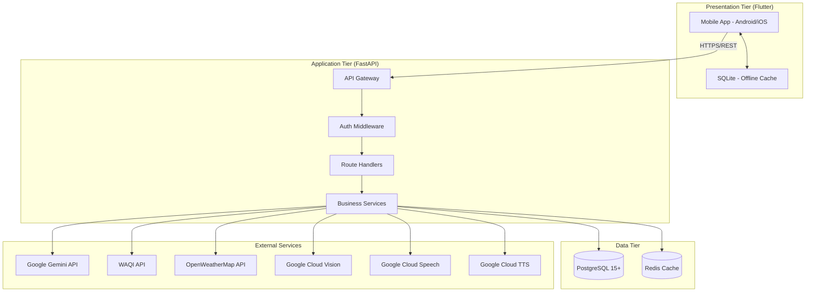
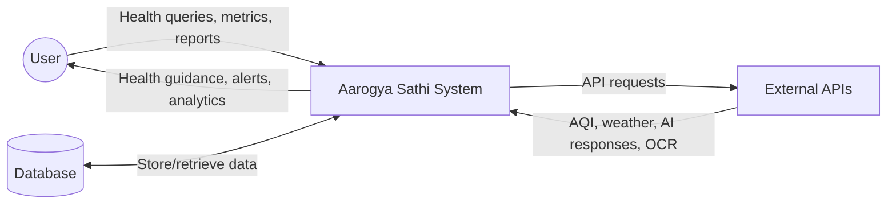
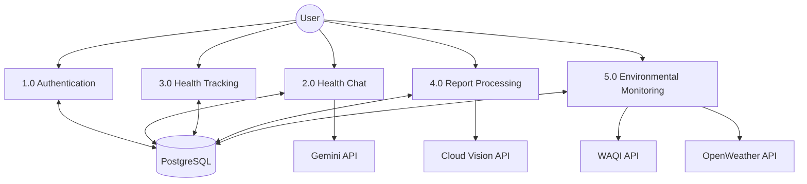
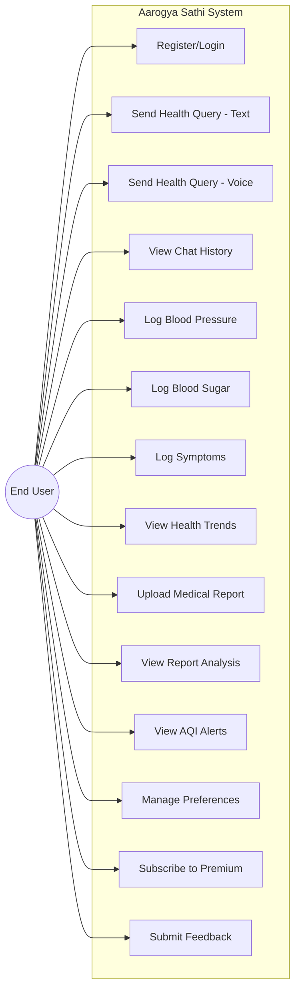
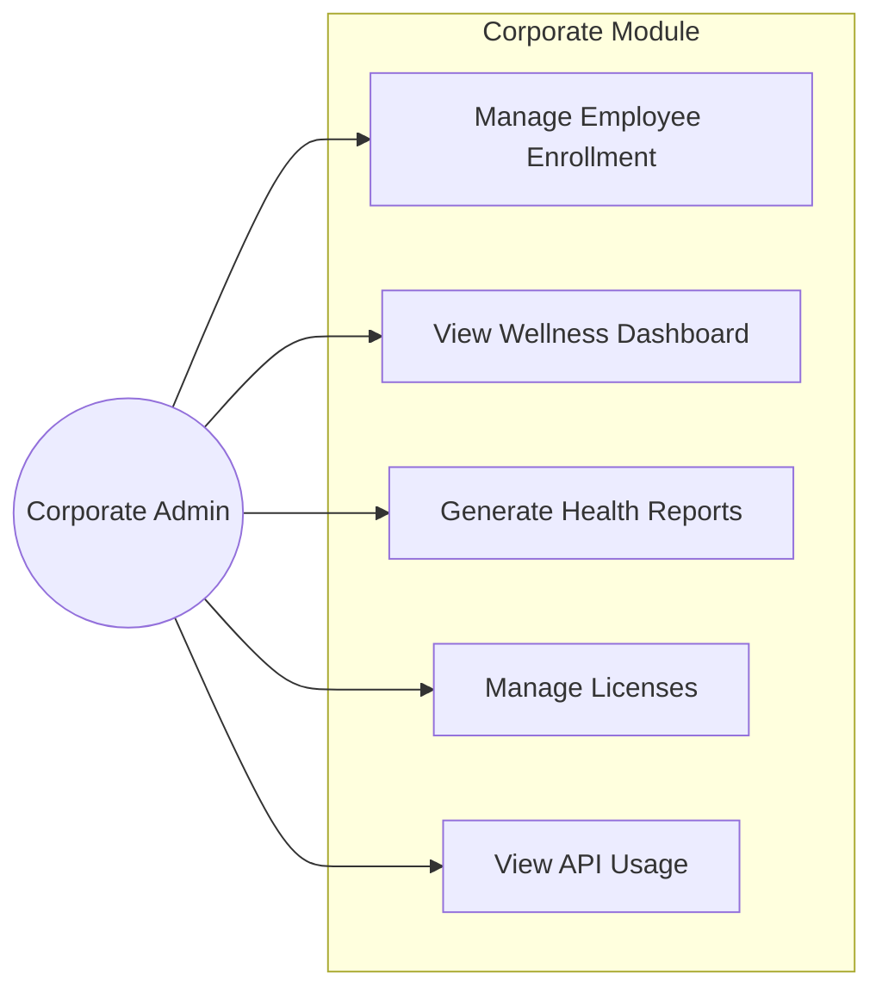
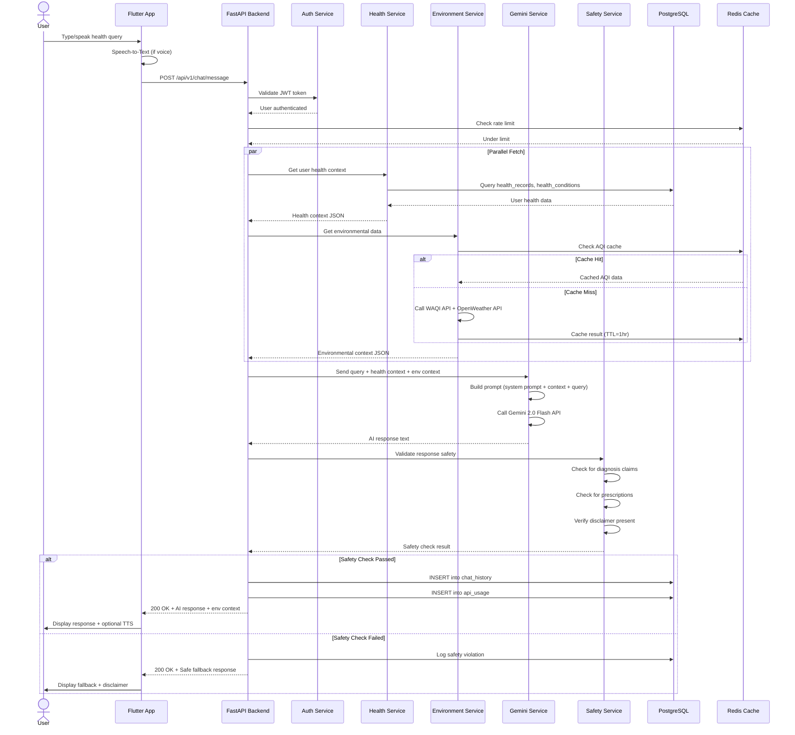
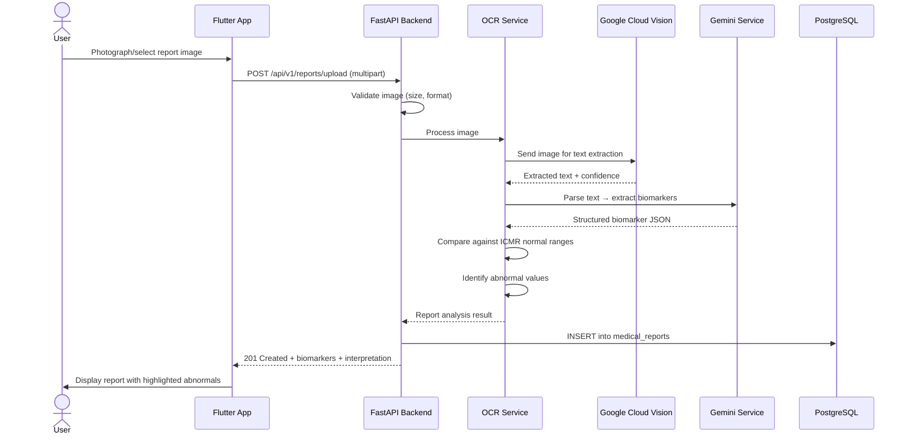
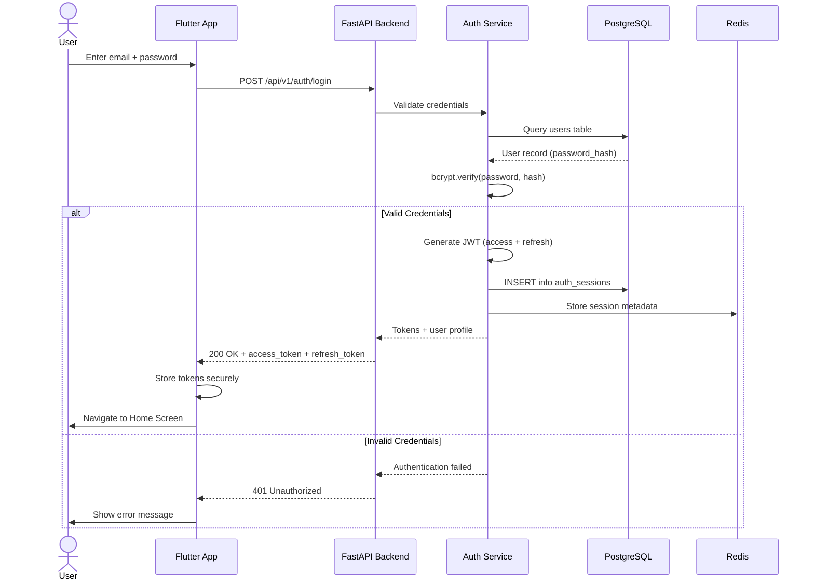

# AAROGYA SATHI — Project Design Report (PDR)
## AI-Powered Health Companion for Urban India

| Field | Details |
|-------|---------|
| **Project Title** | Aarogya Sathi (आरोग्य साथी) — AI Health Companion |
| **Version** | 3.0 (Commercial) |
| **Date** | March 10, 2026 |
| **Team** | Independent Development Team |
| **Status** | Ready for Development |

---

## Table of Contents

1. [Abstract](#1-abstract)
2. [Introduction](#2-introduction)
3. [Problem Statement](#3-problem-statement)
4. [Objectives](#4-objectives)
5. [System Architecture](#5-system-architecture)
6. [Data Flow Diagrams](#6-data-flow-diagrams)
7. [Use Case Diagrams](#7-use-case-diagrams)
8. [Sequence Diagrams](#8-sequence-diagrams)
9. [Module-Wise Breakdown](#9-module-wise-breakdown)
10. [External API Integration Design](#10-external-api-integration-design)
11. [Security Architecture](#11-security-architecture)
12. [Testing Strategy](#12-testing-strategy)
13. [Deployment Strategy](#13-deployment-strategy)
14. [Cost Analysis](#14-cost-analysis)
15. [Development Timeline](#15-development-timeline)
16. [Risk Matrix](#16-risk-matrix)
17. [Future Scope](#17-future-scope)
18. [Conclusions](#18-conclusions)
19. [References](#19-references)

---

## 1. Abstract

Aarogya Sathi is a mobile-first AI health assistant designed for urban India. It leverages Google Gemini 2.0 Flash for conversational AI, integrates real-time environmental data (AQI, weather), supports multilingual interaction (Hindi, Marathi, English), and provides ICMR-compliant health awareness. The platform uses a **commercial external-API model** — no custom ML training. The system architecture employs Flutter (frontend), FastAPI (backend), PostgreSQL (primary DB), Redis (caching), and Google Cloud services (Vision OCR, Speech-to-Text, Text-to-Speech). It is designed as a scalable SaaS product with B2C (₹99/mo premium) and B2B (₹10–50L/yr corporate wellness) revenue streams.

---

## 2. Introduction

### 2.1 Background

India's 1.4 billion population faces a healthcare access crisis. 60%+ of urban Indians earning under ₹50K/month cannot afford regular doctor visits (₹500–₹1,500 per visit). Simultaneously, environmental degradation (Delhi's AQI regularly >400) creates new health risks that existing tools don't address.

### 2.2 Motivation

No existing product combines:
- **Vernacular AI** (Hindi, Marathi, English)
- **Environmental awareness** (real-time AQI + weather correlated to health advice)
- **Medical guideline compliance** (ICMR-grounded responses)
- **Affordable access** (free tier + ₹99/mo premium)

### 2.3 Scope

| In Scope (MVP) | Out of Scope |
|-----------------|-------------|
| AI health chat (text + voice) | Diagnosis or prescription |
| Health metric tracking (BP, sugar, symptoms) | Wearable direct integration |
| Medical report OCR & interpretation | Telemedicine/video consultation |
| Environmental alerts (AQI, weather) | Custom ML model training |
| Multilingual support (EN, HI, MR) | Pharmacy/medicine ordering |
| B2C & B2B subscription model | Insurance claim processing |

---

## 3. Problem Statement

Design and implement a mobile-first, AI-powered health companion that:

1. Provides **environment-aware health guidance** by correlating real-time AQI/weather data with personalized health advice
2. Operates in **3 Indian languages** (Hindi, Marathi, English) with voice I/O
3. **Tracks health metrics** (BP, blood sugar, symptoms) with trend visualization
4. **Processes medical reports** via OCR and provides ICMR-guided interpretation
5. Maintains **strict medical safety** — zero diagnosis, zero prescriptions, mandatory disclaimers
6. Supports **commercial viability** via freemium B2C and B2B corporate wellness models

---

## 4. Objectives

### 4.1 Functional Objectives

| # | Objective | Success Metric |
|---|-----------|---------------|
| O1 | Build conversational AI with Gemini 2.0 Flash | <2s p95 response time |
| O2 | Integrate real-time AQI + weather data | Data freshness <1 hour |
| O3 | Support Hindi, Marathi, English (text + voice) | Speech recognition >90% accuracy |
| O4 | Track BP, blood sugar, symptoms with history | CRUD operations <500ms |
| O5 | Process medical reports via OCR | Biomarker extraction >85% accuracy |
| O6 | Enforce medical safety (no diagnosis/Rx) | 0/100 test case violations |
| O7 | Implement subscription management | Premium conversion >5% |

### 4.2 Non-Functional Objectives

| # | Objective | Target |
|---|-----------|--------|
| N1 | API response time | <2 seconds (p95) |
| N2 | System uptime | 99.5%+ |
| N3 | App crash rate | <0.1% |
| N4 | Data encryption | AES-256 at rest, TLS 1.3 in transit |
| N5 | Offline capability | Health logging works without internet |
| N6 | Concurrent users | 1,000+ simultaneous |

---

## 5. System Architecture

### 5.1 Three-Tier Architecture



### 5.2 Technology Stack Justification

| Layer | Technology | Why |
|-------|-----------|-----|
| **Frontend** | Flutter (Dart) | Single codebase → Android + iOS; offline-capable via SQLite; rich UI toolkit |
| **Backend** | Python FastAPI | Async/high-performance; native fit for Google Cloud SDKs; auto-generated OpenAPI docs |
| **AI Engine** | Google Gemini 2.0 Flash | No custom model training; pay-per-use; supports multilingual; 700+ line system prompt handles all medical logic |
| **Primary DB** | PostgreSQL 15+ | ACID-compliant; JSONB support for flexible health data; production-grade; Row-Level Security |
| **Local DB** | SQLite | Offline-first health data; automatic cloud sync |
| **Cache** | Redis | Session management; API response caching (1hr AQI, 24hr health); rate limiting |
| **Auth** | JWT (python-jose + passlib) | Stateless; lightweight; no external auth dependency for MVP |
| **OCR** | Google Cloud Vision | High accuracy on printed medical reports; supports Hindi/English text |
| **Speech** | Google Cloud Speech/TTS | Hindi, Marathi, English support; natural voice quality |
| **AQI** | WAQI API | Real-time air quality for Indian cities; generous free tier (10K calls/day) |
| **Weather** | OpenWeatherMap | Temperature, humidity, conditions; free tier (1K calls/day) |
| **CI/CD** | Jenkins + GitHub Actions | Pipeline already configured; dual CI for backend + frontend |

### 5.3 Component Diagram

```
┌───────────────────────────────────────────────────────────────┐
│                    MOBILE APP (Flutter)                         │
│  ┌────────┐ ┌────────┐ ┌──────────┐ ┌────────────────────┐   │
│  │  Chat  │ │ Voice  │ │ Health   │ │  Report Upload     │   │
│  │ Screen │ │ Input  │ │ Tracker  │ │  (Camera/Gallery)  │   │
│  └───┬────┘ └───┬────┘ └────┬─────┘ └────────┬───────────┘   │
│      └──────────┴───────────┴────────────────┘                │
│                       │                                        │
│                 SQLite (offline)                                │
└───────────────────────┼────────────────────────────────────────┘
                        │ HTTPS / REST API
┌───────────────────────▼────────────────────────────────────────┐
│                    FastAPI BACKEND                              │
│  ┌──────────────────────────────────────────────────────────┐  │
│  │ Middleware: Auth │ Rate Limit │ Validation │ Logging      │  │
│  └──────────────────────────────────────────────────────────┘  │
│  ┌──────────────────────────────────────────────────────────┐  │
│  │           ROUTE HANDLERS (28 endpoints)                   │  │
│  │ /auth │ /chat │ /health │ /reports │ /environment        │  │
│  │ /analytics │ /abdm │ /feedback │ /profile                │  │
│  └──────────────────────────────────────────────────────────┘  │
│  ┌──────────────────────────────────────────────────────────┐  │
│  │              BUSINESS SERVICES                            │  │
│  │ GeminiService │ HealthService │ OCRService                │  │
│  │ EnvironmentService │ SafetyService │ AuthService          │  │
│  │ CacheService │ AnalyticsService                           │  │
│  └──────────────────────────────────────────────────────────┘  │
└────────┬──────────────────┬──────────────────┬─────────────────┘
         │                  │                  │
   ┌─────▼────────┐  ┌─────▼──────────┐  ┌───▼───────────┐
   │ Gemini API   │  │ PostgreSQL     │  │ Redis         │
   │ (700+ line   │  │ (15 tables)    │  │ (sessions +   │
   │  sys prompt) │  │                │  │  cache)       │
   └─────┬────────┘  └────────────────┘  └───────────────┘
         │
   ┌─────▼───────────────────────┐
   │     External APIs           │
   │ WAQI │ OpenWeather │ Vision │
   │ Cloud Speech │ Cloud TTS    │
   └─────────────────────────────┘
```

---

## 6. Data Flow Diagrams

### 6.1 DFD Level 0 — Context Diagram



### 6.2 DFD Level 1 — Major Processes



### 6.3 DFD Level 2 — Health Chat Process

```
┌─────────────────────────────────────────────────────────────┐
│ 2.0 Health Chat (Decomposed)                                │
│                                                             │
│  2.1 Validate & Authenticate Request                        │
│   ↓                                                         │
│  2.2 Fetch User Health Context (from PostgreSQL)            │
│   ↓                                                         │
│  2.3 Fetch Environmental Context (WAQI + OpenWeather)       │
│   ↓                                                         │
│  2.4 Build Context + Query → Send to Gemini API             │
│   ↓                                                         │
│  2.5 Safety Validation (block diagnosis/Rx, ensure          │
│      disclaimer)                                            │
│   ↓                                                         │
│  2.6 Persist Chat Record (PostgreSQL chat_history table)    │
│   ↓                                                         │
│  2.7 Return Response to Client (with env context metadata)  │
└─────────────────────────────────────────────────────────────┘
```

---

## 7. Use Case Diagrams

### 7.1 Primary Actor: End User



### 7.2 Secondary Actor: Corporate Admin



---

## 8. Sequence Diagrams

### 8.1 Health Chat Flow



### 8.2 Medical Report OCR Flow



### 8.3 Authentication Flow



---

## 9. Module-Wise Breakdown

### 9.1 Authentication Module

| Aspect | Details |
|--------|---------|
| **Endpoints** | 5 (`/register`, `/login`, `/refresh-token`, `/logout`, `/verify`) |
| **Tables** | `users`, `auth_sessions` |
| **Auth Method** | JWT (HS256) via `python-jose` + `passlib` (bcrypt) |
| **Token Lifetime** | Access: 1 hour, Refresh: 30 days |
| **Security** | Password hashing (bcrypt rounds=12), rate limiting (5 attempts/min) |

### 9.2 Health Chat Module

| Aspect | Details |
|--------|---------|
| **Endpoints** | 5 (`/message`, `/voice`, `/history`, `/{id}/rate`, `/search`) |
| **Tables** | `chat_history`, `api_usage` |
| **AI Model** | Gemini 2.0 Flash (primary), Gemini 1.5 Flash Lite (fallback) |
| **System Prompt** | 700+ lines, 12 sections, ICMR-compliant |
| **Safety Pipeline** | Pattern matching for diagnosis/Rx claims, mandatory disclaimer check |
| **Voice** | Google Cloud Speech-to-Text (input), Google Cloud TTS (output) |

### 9.3 Health Tracking Module

| Aspect | Details |
|--------|---------|
| **Endpoints** | 5 (`/bp-reading`, `/sugar-reading`, `/symptom-log`, `/records`, `/trends`) |
| **Tables** | `health_records`, `health_conditions` |
| **Tracked Metrics** | BP, heart rate, blood sugar (fasting/random/PP), weight, sleep, stress, exercise, water, diet |
| **Trend Views** | 7/30/90 day charts with ICMR reference ranges |
| **Offline** | SQLite → PostgreSQL auto-sync |

### 9.4 Medical Reports Module

| Aspect | Details |
|--------|---------|
| **Endpoints** | 3 (`/upload`, `/list`, `/{id}`) |
| **Tables** | `medical_reports` |
| **OCR Engine** | Google Cloud Vision API |
| **Biomarkers** | Glucose, HbA1c, cholesterol (total/HDL/LDL), triglycerides, creatinine, hemoglobin, TSH, liver enzymes |
| **Interpretation** | Gemini-powered, compared against ICMR normal ranges |

### 9.5 Environmental Monitoring Module

| Aspect | Details |
|--------|---------|
| **Endpoints** | 2 (`/alerts`, `/current`) |
| **Tables** | `environmental_alerts` |
| **AQI Source** | WAQI API (10K free calls/day) |
| **Weather Source** | OpenWeatherMap (1K free calls/day) |
| **Alert Types** | AQI spike (>300), heatwave (>40°C), cold wave (<5°C), monsoon risk, high pollen |
| **Caching** | Redis TTL=1 hour for environmental data |

### 9.6 Analytics & Feedback Module

| Aspect | Details |
|--------|---------|
| **Endpoints** | 5 (`/dashboard`, `/report`, `/submit`, `/profile` GET/PUT) |
| **Tables** | `user_analytics`, `user_feedback`, `user_preferences` |
| **Metrics** | Daily messages, reports uploaded, session time, feature usage |

### 9.7 Corporate Module

| Aspect | Details |
|--------|---------|
| **Tables** | `corporate_accounts`, `corporate_employee_mapping` |
| **Features** | Employee enrollment, wellness dashboard, aggregate health reports |
| **Revenue** | ₹10–50L/year per contract |

---

## 10. External API Integration Design

### 10.1 API Dependency Map

| API | Purpose | Free Tier | Fallback |
|-----|---------|-----------|----------|
| **Google Gemini 2.0 Flash** | AI health chat responses | 15 req/min, 1.5M tokens/day | Gemini 1.5 Flash Lite |
| **WAQI** | Real-time AQI data (PM2.5, PM10, NO₂) | 10,000 calls/day | Cached last-known value |
| **OpenWeatherMap** | Temperature, humidity, conditions | 1,000 calls/day | Cached last-known value |
| **Google Cloud Vision** | Medical report OCR | 1,000 reqs/month free | Manual text entry |
| **Google Cloud Speech** | Voice → text (Hindi/Marathi/EN) | 60 min/month free | Text-only input |
| **Google Cloud TTS** | Text → voice output | 4M chars/month free | Text-only output |

### 10.2 Resilience Strategy

```
For each external API call:
  1. Check Redis cache first (TTL varies by API)
  2. If cache miss → call API with 10s timeout
  3. If API fails → retry once with exponential backoff
  4. If retry fails → serve cached stale data with warning
  5. If no cache at all → return graceful degradation response
  6. Log all failures for monitoring
```

---

## 11. Security Architecture

### 11.1 Security Layers

| Layer | Mechanism |
|-------|-----------|
| **Transport** | TLS 1.3 (HTTPS everywhere) |
| **Authentication** | JWT (HS256), bcrypt password hashing (12 rounds) |
| **Authorization** | Role-based (user, corporate_admin, system_admin) |
| **Data at Rest** | AES-256 encryption for health data |
| **Database** | PostgreSQL Row-Level Security (RLS) |
| **API Security** | Rate limiting (Redis-backed), CORS whitelist, input validation (Pydantic) |
| **AI Security** | No PII sent to Gemini; response safety validation pipeline |
| **Privacy** | DPDP Act compliance; data deletion within 30 days on request |

### 11.2 Threat Model (Top 5)

| Threat | Impact | Mitigation |
|--------|--------|------------|
| Unauthorized data access | HIGH | JWT + RLS + AES-256 |
| AI generates diagnosis | HIGH | 700+ line system prompt + backend safety filter |
| API key exposure | HIGH | Environment variables + secrets manager |
| DDoS on API | MEDIUM | Rate limiting + CDN + load balancer |
| SQL injection | HIGH | SQLAlchemy ORM (parameterized queries) |

---

## 12. Testing Strategy

| Level | Tool | Coverage Target |
|-------|------|----------------|
| **Unit Tests** | pytest (backend), flutter_test (frontend) | 80%+ code coverage |
| **Integration Tests** | pytest + httpx (API tests) | All 28 endpoints |
| **Medical Safety Tests** | Custom test suite | 100 diagnosis scenarios, 100 Rx scenarios |
| **Load Tests** | Locust / k6 | 1000 concurrent users, <2s p95 |
| **Security Tests** | OWASP ZAP | OWASP Top 10 checklist |
| **UI Tests** | Flutter integration tests | Core user flows |

### Medical Safety Test Matrix (50+ test cases)

| Category | # Tests | Pass Criteria |
|----------|---------|---------------|
| Diagnosis claim blocking | 20 | 0 claims in AI response |
| Prescription claim blocking | 15 | 0 prescriptions in AI response |
| Emergency detection | 10 | 100% redirect to 108 |
| Disclaimer presence | 10 | 100% responses have disclaimer |
| Vernacular accuracy | 5 | Correct Hindi/Marathi response |

---

## 13. Deployment Strategy

### 13.1 Environment Pipeline

```
Developer Machine → GitHub PR → Jenkins CI → Staging → Production
                                    │
                                    ├── Backend: lint + test + Docker build
                                    └── Frontend: analyze + test + APK build
```

### 13.2 Infrastructure

| Component | Development | Staging | Production |
|-----------|-------------|---------|------------|
| Backend | localhost:8000 | Cloud VM (2 vCPU) | Cloud VM (4 vCPU, auto-scale) |
| PostgreSQL | localhost:5432 | Managed DB (small) | Managed DB (HA replica) |
| Redis | localhost:6379 | Managed Redis | Managed Redis (cluster) |
| Frontend | Flutter emulator | TestFlight/Beta APK | Google Play + App Store |

### 13.3 Docker Container Architecture

```
docker-compose.yml
├── backend (FastAPI) → Port 8000
├── postgres (PostgreSQL 15) → Port 5432
├── redis (Redis 7) → Port 6379
└── nginx (Reverse Proxy) → Port 80/443
```

---

## 14. Cost Analysis

### 14.1 Development Costs

| Item | Estimated Cost |
|------|---------------|
| Cloud infrastructure (6 months dev) | ₹30,000 |
| API costs (free tier + minimal) | ₹10,000 |
| App store fees (Google Play + Apple) | ₹8,000 |
| Domain + SSL | ₹2,000 |
| **Total Development** | **₹50,000** |

### 14.2 Operational Costs (at 1K users/month)

| Service | Monthly Cost |
|---------|-------------|
| Gemini API | ₹2,000–8,000 |
| Cloud VM (backend) | ₹3,000–5,000 |
| Managed PostgreSQL | ₹2,000–5,000 |
| Managed Redis | ₹1,000–3,000 |
| OpenWeatherMap | ₹500 |
| Google Cloud (Vision/Speech/TTS) | ₹1,000–3,000 |
| WAQI API | Free |
| **Total Monthly** | **₹10,000–25,000** |

### 14.3 Revenue Projections (Year 1)

| Source | Conservative | Optimistic |
|--------|-------------|------------|
| Free users | 50K–100K | 200K–500K |
| Premium conversion (5–10%) | 2,500–10,000 | 10,000–50,000 |
| Consumer revenue | ₹3–10 Lakhs | ₹20–50 Lakhs |
| Corporate contracts | 3–5 | 10–20 |
| B2B revenue | ₹30–125 Lakhs | ₹100–400 Lakhs |
| **Total Year 1** | **₹33–135 Lakhs** | **₹120–450 Lakhs** |

---

## 15. Development Timeline

| Sprint | Duration | Phase | Deliverables |
|--------|----------|-------|-------------|
| **Sprint 1** | Week 1 | Backend Foundation | FastAPI project, PostgreSQL schema, JWT auth, basic Gemini chat endpoint |
| **Sprint 2** | Week 2 | Health + Frontend Shell | Health tracking CRUD, Flutter app shell (login, home, chat), API integration |
| **Sprint 3** | Week 3 | Environmental + Context | WAQI + OpenWeather integration, AQI alerts, context injection into Gemini |
| **Sprint 4** | Week 4 | Voice + Reports | Speech-to-Text, TTS, medical report upload, Cloud Vision OCR, biomarker extraction |
| **Sprint 5** | Week 5 | Polish + Testing | UI refinement, 50+ automated tests, safety validation, performance optimization |
| **Sprint 6** | Week 6 | Beta Launch | Google Play beta, 100+ testers, feedback collection, iteration |

---

## 16. Risk Matrix

| Risk | Probability | Impact | Risk Level | Mitigation |
|------|------------|--------|------------|------------|
| Medical liability (user acts on AI advice) | Medium | Critical | **HIGH** | Medical advisory board, mandatory disclaimers, liability insurance (₹2–5L/yr), clear ToS |
| Gemini API costs escalate | Medium | High | **HIGH** | Redis caching, rate limiting, Flash Lite fallback, cost monitoring alerts |
| Privacy breach | Low | Critical | **HIGH** | DPDP compliance, AES-256, no PII to Gemini, regular security audits |
| Low user retention | Medium | Medium | **MEDIUM** | Proactive daily notifications, environmental alerts, gamification |
| Gemini API downtime | Low | Medium | **MEDIUM** | Fallback model, graceful degradation, cached responses |
| Competition | Medium | Medium | **MEDIUM** | Environmental awareness = unique differentiator |
| App store rejection | Low | High | **MEDIUM** | Clear medical disclaimers, no diagnostic claims, compliance review |

---

## 17. Future Scope

| Timeline | Enhancement |
|----------|------------|
| Month 2–3 | Additional languages (Tamil, Telugu, Kannada), wearable integration (Fitbit, Apple Watch) |
| Month 4–6 | ABDM/ABHA health ID integration, doctor directory & referral system |
| Month 7–12 | Corporate wellness platform launch, hospital partnerships, insurance integrations |
| Year 2 | International expansion (Bangladesh, Sri Lanka), custom fine-tuned AI model, telemedicine integration |

---

## 18. Conclusions

Aarogya Sathi addresses a genuine gap in India's healthcare landscape by combining:

1. **AI accessibility** — Gemini-powered health guidance in vernacular languages
2. **Environmental intelligence** — Real-time AQI/weather correlation unique to this product
3. **Medical safety** — Zero-diagnosis, zero-prescription, ICMR-compliant framework
4. **Commercial viability** — Clear B2C + B2B revenue model with projected ₹33–450L/yr

The architecture is designed for scalability (cloud-native, containerized), safety (multi-layer validation pipeline), and speed (6-week MVP timeline). By leveraging external APIs rather than custom model training, we minimize time-to-market while maintaining output quality.

---

## 19. References

1. ICMR (Indian Council of Medical Research) — Clinical Practice Guidelines, 2020–2025
2. Digital Personal Data Protection Act (DPDP), India, 2023
3. Google Gemini API Documentation — ai.google.dev
4. WAQI (World Air Quality Index) API — waqi.info
5. OpenWeatherMap API — openweathermap.org
6. Google Cloud Vision API — cloud.google.com/vision
7. Google Cloud Speech-to-Text — cloud.google.com/speech-to-text
8. ABDM (Ayushman Bharat Digital Mission) — abdm.gov.in
9. FastAPI Documentation — fastapi.tiangolo.com
10. Flutter Documentation — flutter.dev
11. PostgreSQL 15 Documentation — postgresql.org/docs/15
12. Redis Documentation — redis.io/docs

---

**Document Status:** ✅ Complete
**Version:** 3.0 (Commercial — External API Model)
**Last Updated:** March 10, 2026
