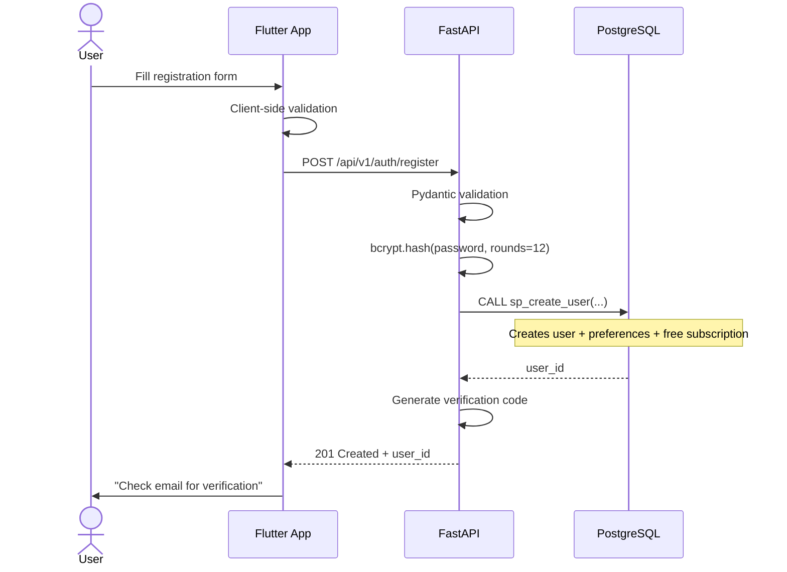

# AAROGYA SATHI — Technology Workflow Document
## Complete End-to-End Technical Flows

**Version:** 3.0 | **Date:** March 10, 2026 | **Stack:** Flutter + FastAPI + PostgreSQL + Gemini API

---

## Table of Contents

1. [End-to-End Request Lifecycle](#1-end-to-end-request-lifecycle)
2. [Authentication Flow](#2-authentication-flow)
3. [Health Chat Workflow](#3-health-chat-workflow)
4. [Health Tracking Workflow](#4-health-tracking-workflow)
5. [Medical Report OCR Workflow](#5-medical-report-ocr-workflow)
6. [Environmental Data Workflow](#6-environmental-data-workflow)
7. [Offline Sync Workflow](#7-offline-sync-workflow)
8. [Caching Strategy](#8-caching-strategy)
9. [Push Notification Flow](#9-push-notification-flow)
10. [Error Handling & Fallback Chains](#10-error-handling--fallback-chains)
11. [API Integration Workflows](#11-api-integration-workflows)
12. [Data Pipeline Architecture](#12-data-pipeline-architecture)

---

## 1. End-to-End Request Lifecycle

### Generic Request Flow

```
┌──────────┐    ┌──────────────┐    ┌──────────────────────┐    ┌────────────┐
│  Flutter  │───>│  Nginx/LB    │───>│  FastAPI Backend      │───>│ PostgreSQL │
│  App      │<───│  (TLS 1.3)   │<───│                      │<───│            │
└──────────┘    └──────────────┘    │  ┌────────────────┐   │    └────────────┘
                                    │  │ 1. Auth MW      │   │
                                    │  │ 2. Rate Limit   │   │    ┌────────────┐
                                    │  │ 3. Validation   │   │───>│  Redis     │
                                    │  │ 4. Route Handler│   │<───│  (Cache)   │
                                    │  │ 5. Service Layer│   │    └────────────┘
                                    │  │ 6. DB/API Call  │   │
                                    │  │ 7. Response     │   │    ┌────────────┐
                                    │  └────────────────┘   │───>│ External   │
                                    └──────────────────────┘    │ APIs       │
                                                                └────────────┘
```

### Request Processing Pipeline (Every Request)

| Step | Component | Action | Failure Handling |
|------|-----------|--------|-----------------|
| 1 | **TLS Termination** | Nginx decrypts HTTPS | Connection refused |
| 2 | **Load Balancing** | Route to healthy backend | 502 Bad Gateway |
| 3 | **CORS Check** | Validate origin whitelist | 403 Forbidden |
| 4 | **Auth Middleware** | JWT token validation | 401 Unauthorized |
| 5 | **Rate Limiting** | Redis token bucket check | 429 Too Many Requests |
| 6 | **Input Validation** | Pydantic schema validation | 422 Unprocessable Entity |
| 7 | **Route Handler** | Business logic execution | 500 Internal Server Error |
| 8 | **Response Serialization** | Pydantic response model | 500 Serialization Error |
| 9 | **Logging** | Structured JSON log | Non-blocking (async) |

---

## 2. Authentication Flow

### 2.1 Registration Flow



### 2.2 Login + JWT Lifecycle

```
Login Request
    │
    ├─ Validate credentials (bcrypt.verify)
    ├─ Generate access_token (JWT, exp=1hr)
    ├─ Generate refresh_token (JWT, exp=30days)
    ├─ Store session in auth_sessions table
    ├─ Cache session metadata in Redis
    │
    ▼
API Requests (with access_token)
    │
    ├─ Middleware decodes JWT
    ├─ Checks token expiry
    ├─ Validates user is_active
    │
    ├─ If token EXPIRED:
    │   ├─ Client calls POST /refresh-token
    │   ├─ Validates refresh_token
    │   ├─ Issues new access_token
    │   └─ Returns to client
    │
    ├─ If refresh_token EXPIRED:
    │   ├─ Returns 401
    │   └─ Client redirects to login
    │
    └─ If token VALID:
        └─ Proceed to route handler
```

### 2.3 Token Security

| Parameter | Value |
|-----------|-------|
| Algorithm | HS256 |
| Access Token TTL | 3600 seconds (1 hour) |
| Refresh Token TTL | 2592000 seconds (30 days) |
| Password Hashing | bcrypt (12 rounds) |
| Token Storage (Client) | Flutter Secure Storage (Keychain/Keystore) |
| Session Tracking | `auth_sessions` table + Redis |

---

## 3. Health Chat Workflow

### 3.1 Complete Chat Pipeline

```
User Input (Text or Voice)
    │
    ├─ [If Voice] ──── Google Cloud Speech API ──── Transcribed Text
    │                         │
    │                    Language Detection
    │
    ▼
POST /api/v1/chat/message
    │
    ├─ 1. AUTH: Validate JWT
    ├─ 2. RATE LIMIT: Check Redis (5 req/min free, unlimited premium)
    ├─ 3. VALIDATE: Pydantic schema check
    │
    ├─ 4. PARALLEL FETCH:
    │   ├─ a. USER HEALTH CONTEXT ──── PostgreSQL
    │   │       ├─ Latest BP reading
    │   │       ├─ Latest sugar reading
    │   │       ├─ Active conditions
    │   │       └─ Current medications
    │   │
    │   └─ b. ENVIRONMENTAL CONTEXT
    │           ├─ Check Redis cache (TTL=1hr)
    │           ├─ If miss → WAQI API (AQI data)
    │           ├─ If miss → OpenWeather API (weather)
    │           └─ Cache result in Redis
    │
    ├─ 5. BUILD GEMINI PROMPT:
    │       System Prompt (700+ lines)
    │       + Environmental Context JSON
    │       + User Health Context JSON
    │       + User Query
    │
    ├─ 6. CALL GEMINI API:
    │       Model: gemini-2.0-flash
    │       Temperature: 0.3
    │       Max Tokens: 1000
    │       Timeout: 10s
    │
    │       [If Gemini fails] → Retry with gemini-1.5-flash-lite
    │       [If retry fails] → Return cached/fallback response
    │
    ├─ 7. SAFETY VALIDATION:
    │       ├─ Check for diagnosis claims → BLOCK
    │       ├─ Check for prescription claims → BLOCK
    │       ├─ Check for emergency keywords → FLAG
    │       ├─ Verify disclaimer present → WARN if missing
    │       └─ If failed → Return safe fallback response
    │
    ├─ 8. PERSIST:
    │       ├─ INSERT into chat_history
    │       ├─ Trigger: trg_log_chat_api_usage → api_usage
    │       ├─ Trigger: trg_emergency_alert_chat (if emergency)
    │       └─ UPDATE user_analytics
    │
    └─ 9. RESPOND:
            ├─ AI response text
            ├─ Environmental context metadata
            ├─ Safety metadata
            ├─ Response time (ms)
            └─ Token usage count
```

### 3.2 Safety Validation Pipeline (Detail)

```python
# Pseudo-code for safety validation
BLOCKED_PATTERNS = [
    r"you have \w+",          # Diagnosis
    r"diagnosis is",           # Diagnosis
    r"take \w+ \d+mg",         # Prescription
    r"prescription",           # Prescription
    r"you are suffering from", # Diagnosis
]

REQUIRED_PATTERNS = [
    r"(disclaimer|consult|doctor|professional|healthcare)"
]

EMERGENCY_KEYWORDS = [
    "chest pain", "can't breathe", "unconscious",
    "severe bleeding", "heart attack", "stroke"
]

def validate_response(response: str) -> SafetyResult:
    # Check blocks
    for pattern in BLOCKED_PATTERNS:
        if re.search(pattern, response, re.I):
            return SafetyResult(passed=False, reason="diagnosis/Rx detected")

    # Check required
    if not any(re.search(p, response, re.I) for p in REQUIRED_PATTERNS):
        return SafetyResult(passed=False, reason="missing disclaimer")

    # Check emergency
    is_emergency = any(kw in response.lower() for kw in EMERGENCY_KEYWORDS)

    return SafetyResult(passed=True, is_emergency=is_emergency)
```

---

## 4. Health Tracking Workflow

### 4.1 BP/Sugar Logging Pipeline

```
User enters reading in app
    │
    ├─ Client-side validation (range checks)
    ├─ Store locally in SQLite (offline-first)
    ├─ Mark record for cloud sync
    │
    ▼
POST /api/v1/health/bp-reading (or /sugar-reading)
    │
    ├─ AUTH + RATE LIMIT + VALIDATE
    │
    ├─ CALL sp_log_health_record(...)
    │   ├─ INSERT into health_records
    │   ├─ Compare against ICMR thresholds
    │   ├─ Generate alert if abnormal
    │   └─ Update user_analytics
    │
    ├─ RESPONSE:
    │   ├─ Record ID
    │   ├─ Status (normal/elevated/high)
    │   ├─ ICMR reference range
    │   ├─ Comparison with historical average
    │   ├─ Trend direction (stable/rising/falling)
    │   └─ Recommendations
    │
    └─ CLIENT:
        ├─ Update local SQLite (mark synced)
        ├─ Refresh health dashboard charts
        └─ Show alert notification if abnormal
```

### 4.2 Health Trends Data Flow

```
GET /api/v1/health/trends?metric=blood_pressure&days=90
    │
    ├─ Execute CTE query with window functions
    │   ├─ Daily averages
    │   ├─ 7-day moving average
    │   ├─ Trend direction (LAG comparison)
    │   └─ Min/Max/Statistics
    │
    ├─ Cache result in Redis (TTL=24hr, invalidated on new record)
    │
    └─ RESPONSE → Flutter fl_chart line chart rendering
```

---

## 5. Medical Report OCR Workflow

```
User photographs/selects report image
    │
    ├─ Client-side: Compress if >5MB
    ├─ Client-side: Validate file type (JPG/PNG)
    │
    ▼
POST /api/v1/reports/upload (multipart/form-data)
    │
    ├─ 1. VALIDATE: File size (<10MB), type, auth
    │
    ├─ 2. STORE: Upload to cloud storage (S3/GCS)
    │       └─ Encrypted at rest (AES-256)
    │
    ├─ 3. OCR (Google Cloud Vision API):
    │       ├─ Send image bytes
    │       ├─ Receive: full extracted text + confidence score
    │       └─ Language detection (Hindi/English)
    │
    ├─ 4. BIOMARKER EXTRACTION (Gemini API):
    │       ├─ Send extracted text to Gemini
    │       ├─ Prompt: "Extract biomarkers into structured JSON"
    │       └─ Receive: {glucose: 125, HbA1c: 7.2, ...}
    │
    ├─ 5. ICMR COMPARISON:
    │       ├─ For each biomarker: fn_check_icmr_range()
    │       ├─ Identify abnormal values
    │       └─ Generate interpretation text
    │
    ├─ 6. PERSIST:
    │       ├─ INSERT into medical_reports
    │       ├─ Store biomarkers JSON, interpretation, abnormals
    │       └─ Update user_analytics
    │
    └─ 7. RESPONSE:
            ├─ Extracted biomarkers table
            ├─ Each value vs ICMR normal range
            ├─ Abnormal values highlighted
            ├─ AI interpretation (awareness only)
            └─ Disclaimer
```

---

## 6. Environmental Data Workflow

```
Environmental Data Flow
══════════════════════════

Every Request:
    ├─ Check Redis cache for user's city
    │   Key: "env:{city}" | TTL: 3600s (1 hour)
    │
    ├─ If CACHE HIT → Return cached data
    │
    ├─ If CACHE MISS:
    │   ├─ Parallel API calls:
    │   │   ├─ WAQI API → AQI, PM2.5, PM10, NO₂, SO₂
    │   │   └─ OpenWeatherMap → Temp, humidity, wind, conditions
    │   │
    │   ├─ Merge data into environmental context JSON
    │   ├─ Store in Redis (TTL=1hr)
    │   │
    │   ├─ Check alert thresholds:
    │   │   ├─ AQI > 300 → Severe alert
    │   │   ├─ Temp > 40°C → Heatwave alert
    │   │   ├─ Temp < 5°C → Cold wave alert
    │   │   └─ Heavy rain → Monsoon risk alert
    │   │
    │   └─ If threshold breached:
    │       └─ CALL sp_process_environmental_alerts(city, aqi, temp)
    │           ├─ Create alerts for all users in that city
    │           └─ Trigger push notifications

Scheduled Job (Every 30 min):
    ├─ For each supported city (10 cities):
    │   └─ Fetch fresh AQI + weather → Update cache → Check thresholds
    └─ Supported: Delhi, Mumbai, Pune, Bangalore, Chennai,
                  Hyderabad, Nagpur, Jaipur, Lucknow, Kolkata
```

---

## 7. Offline Sync Workflow

```
┌─────────────────────────────────────────────────────────┐
│                    FLUTTER APP                           │
│                                                         │
│  ┌─────────────┐         ┌──────────────────────────┐  │
│  │  UI Layer   │ ──────> │  Sync Manager            │  │
│  │             │ <────── │  (Background Isolate)     │  │
│  └─────────────┘         │                          │  │
│                           │  ┌────────────────────┐  │  │
│                           │  │ Sync Queue          │  │  │
│                           │  │ (pending_sync table)│  │  │
│                           │  └─────────┬──────────┘  │  │
│                           └────────────┼─────────────┘  │
│                                        │                │
│  ┌─────────────────────────────────────┼──────────────┐ │
│  │  SQLite Local Database              │              │ │
│  │  ├─ health_records_local            │              │ │
│  │  ├─ chat_history_local              │              │ │
│  │  └─ pending_sync (queue)            │              │ │
│  └─────────────────────────────────────┼──────────────┘ │
└────────────────────────────────────────┼────────────────┘
                                         │
                            ┌────────────▼────────────┐
                            │  When Online:           │
                            │                         │
                            │  1. Check pending_sync  │
                            │  2. Batch POST to API   │
                            │  3. Mark synced         │
                            │  4. Pull new data       │
                            │  5. Resolve conflicts   │
                            │     (server wins)       │
                            └────────────┬────────────┘
                                         │
                            ┌────────────▼────────────┐
                            │  FastAPI Backend         │
                            │  → PostgreSQL (primary)  │
                            └─────────────────────────┘

Conflict Resolution: Server-wins strategy
  - If record exists on both sides with different timestamps:
    - Server record takes priority
    - Local changes are discarded with user notification
```

---

## 8. Caching Strategy

### 8.1 Redis Cache Architecture

| Key Pattern | TTL | Purpose | Invalidation |
|------------|-----|---------|-------------|
| `env:{city}` | 1 hour | AQI + weather data | Time-based |
| `session:{user_id}` | 1 hour | JWT session metadata | On logout |
| `rate:{user_id}:{endpoint}` | 1 minute | Rate limiting counter | Time-based |
| `health_ctx:{user_id}` | 24 hours | User health context for Gemini | On new health record |
| `trends:{user_id}:{metric}:{days}` | 24 hours | Pre-computed trend data | On new health record |
| `report:{report_id}` | 7 days | Processed report results | On report update |

### 8.2 Cache Invalidation Flow

```
New Health Record Inserted
    │
    ├─ DELETE health_ctx:{user_id}
    ├─ DELETE trends:{user_id}:*
    └─ Next request rebuilds cache automatically
```

---

## 9. Push Notification Flow

```
Notification Triggers:
    │
    ├─ Environmental Alert (AQI spike, heatwave)
    │   └─ sp_process_environmental_alerts() → Notification Queue
    │
    ├─ Health Threshold Breach (BP >180, Sugar >200)
    │   └─ sp_log_health_record() → Notification Queue
    │
    ├─ Subscription Expiry Reminder (3 days before)
    │   └─ Scheduled Job → Notification Queue
    │
    ├─ Daily Health Tip (Morning, personalized)
    │   └─ Scheduled Job → Gemini API → Notification Queue
    │
    └─ Report Ready (after OCR processing)
        └─ OCR Pipeline → Notification Queue

Notification Queue → Firebase Cloud Messaging (FCM) → Flutter App
    │
    ├─ Android: FCM → Notification Channel
    └─ iOS: FCM → APNs → Notification
```

---

## 10. Error Handling & Fallback Chains

### 10.1 Gemini API Fallback Chain

```
Attempt 1: gemini-2.0-flash (timeout=10s)
    │
    ├─ SUCCESS → Return response
    │
    └─ FAILURE (timeout/error)
        │
        ▼
Attempt 2: gemini-2.0-flash (retry, timeout=15s)
    │
    ├─ SUCCESS → Return response
    │
    └─ FAILURE
        │
        ▼
Attempt 3: gemini-1.5-flash-lite (fallback model, timeout=10s)
    │
    ├─ SUCCESS → Return response + "using fallback model" flag
    │
    └─ FAILURE
        │
        ▼
Return cached similar response (if available in Redis)
    │
    ├─ CACHE HIT → Return with "cached response" flag
    │
    └─ CACHE MISS → Return safe generic response:
        "I'm having trouble connecting right now. Please try again
         in a few minutes. For urgent health concerns, call 108."
```

### 10.2 External API Fallback Matrix

| API | Primary | Retry | Fallback | Last Resort |
|-----|---------|-------|----------|-------------|
| Gemini | 2.0 Flash | Same | 1.5 Flash Lite | Cached/generic response |
| WAQI | Live API | Same | Redis cache | "AQI data unavailable" |
| OpenWeather | Live API | Same | Redis cache | "Weather data unavailable" |
| Cloud Vision | Live API | Same | — | "Manual entry required" |
| Cloud Speech | Live API | Same | — | "Please type your query" |

### 10.3 HTTP Error Response Format

```json
{
    "status": "error",
    "error": {
        "code": "GEMINI_TIMEOUT",
        "message": "AI service temporarily unavailable",
        "details": "The health assistant is experiencing high demand. Please try again.",
        "retry_after": 30
    },
    "request_id": "req_550e8400-e29b-41d4"
}
```

---

## 11. API Integration Workflows

### 11.1 Gemini API Integration

```python
# Configuration
MODEL_PRIMARY = "gemini-2.0-flash"
MODEL_FALLBACK = "gemini-1.5-flash-lite"
TEMPERATURE = 0.3          # Low for medical accuracy
MAX_OUTPUT_TOKENS = 1000
TIMEOUT_SECONDS = 10

# Context injection pattern
context = f"""
Environmental Context:
- City: {city}, AQI: {aqi} ({aqi_level})
- Temperature: {temp}°C, Humidity: {humidity}%

User Health Context:
- Recent BP: {bp_systolic}/{bp_diastolic}
- Recent Fasting Sugar: {sugar} mg/dL
- Active Conditions: {conditions}
- Current Medications: {medications}

User Query: {user_message}
"""
```

### 11.2 WAQI API Integration

```
GET https://api.waqi.info/feed/{city}/?token={WAQI_KEY}

Response parsing:
  data.aqi → AQI value
  data.iaqi.pm25.v → PM2.5
  data.iaqi.pm10.v → PM10
  data.iaqi.no2.v → NO₂
```

### 11.3 OpenWeatherMap Integration

```
GET https://api.openweathermap.org/data/2.5/weather
    ?lat={lat}&lon={lon}&appid={KEY}&units=metric

Response parsing:
  main.temp → Temperature (°C)
  main.humidity → Humidity (%)
  wind.speed → Wind (m/s)
  weather[0].description → Conditions
```

---

## 12. Data Pipeline Architecture

### 12.1 Data Lifecycle

```
DATA CREATION → VALIDATION → PROCESSING → STORAGE → ANALYSIS → ARCHIVAL

Health Record:
  User Input → Pydantic Validation → ICMR Check → PostgreSQL → Trend Analysis → Archive (>1yr)

Chat Message:
  Query → Auth + Rate Limit → Gemini AI → Safety Check → PostgreSQL → Analytics → Archive (>6mo)

Medical Report:
  Image → Cloud Vision OCR → Gemini Extract → PostgreSQL → Dashboard → Archive (>1yr)

Environmental Data:
  WAQI/OWM API → Redis Cache → Alert Check → PostgreSQL (alerts only) → Dashboard
```

### 12.2 Analytics Pipeline

```
Raw Data (PostgreSQL)
    │
    ├─ Materialized View: mv_platform_daily_stats (refreshed hourly)
    ├─ CTE Queries: User trends, risk scores, engagement
    │
    ▼
Analytics Dashboard (Flutter)
    ├─ User: Personal health trends, risk score
    ├─ Admin: Platform stats, user engagement
    └─ Corporate: Employee wellness dashboard
```

---

**Document Status:** ✅ Complete
**Version:** 3.0 | **Last Updated:** March 10, 2026
